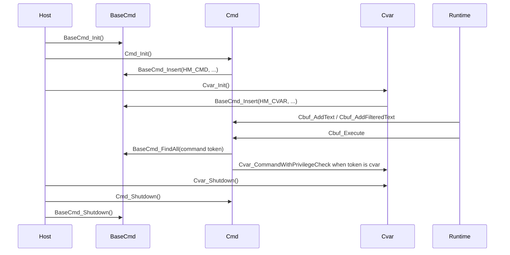

# Command/Cvar Baseline

## Scope

This document captures the current command and cvar architecture before moving
any implementation into `src/engine/commands/`.

Primary legacy files:

- `engine/common/base_cmd.c`
- `engine/common/base_cmd_adapter.cpp`
- `engine/common/base_cmd_adapter.h`
- `engine/common/base_cmd.h`
- `engine/common/cmd.c`
- `engine/common/cvar.c`
- `engine/common/cvar.h`
- related console completion/config helpers in `engine/common/con_utils.c`

Public legacy surfaces must remain C-compatible:

- `BaseCmd_*`
- `Cbuf_*`
- `Cmd_*`
- `Cvar_*`

## Current Ownership

### `base_cmd.c`

`base_cmd.c` owns the public C facade for the command, alias, and cvar shared
registry. Storage is now delegated through `base_cmd_adapter.cpp` to the modern
`BaseCommandRegistry`.

Current state:

- `BaseCommandRegistry` stores 64 buckets behind the private adapter.
- Entries are typed as `HM_CMD`, `HM_CMDALIAS`, or `HM_CVAR`.
- Buckets are kept in case-insensitive alphabetical order by name.

Important functions:

- `BaseCmd_Init`
- `BaseCmd_Shutdown`
- `BaseCmd_Find`
- `BaseCmd_FindAll`
- `BaseCmd_Insert`
- `BaseCmd_Remove`
- `BaseCmd_Stats_f`
- `BaseCmd_Test_f`

Migration note: this has now become the first implementation seam. The public
legacy functions remain in `base_cmd.c`, and their storage behavior routes
through the private C++ adapter.

Behavior notes captured for the first modern helper:

- Lookup is ASCII case-insensitive.
- Commands, aliases, and cvars can share the same textual name in `BaseCmd`.
- The table does not reject duplicate inserts by itself; higher-level command
  and cvar registration owns most duplicate policy.
- When duplicate same-type entries exist, typed `BaseCmd_Find` sees the newest
  duplicate first because insertion places equal names before existing entries.
- `BaseCmd_FindAll` iterates all same-name entries and assigns by type as it
  goes, so duplicate same-type entries leave the older entry as the final
  result. This is a legacy traversal quirk, not a behavior new code should
  depend on.

### `cmd.c`

`cmd.c` owns command buffers, command registration, aliases, command execution,
and command scripting.

Current state:

- `cmd_text` stores privileged command-buffer text.
- `filteredcmd_text` stores server-provided or filterable command-buffer text.
- `cmd_alias` owns aliases.
- `cmd_functions` owns registered command functions.
- `cmd_currentCommandIsPrivileged` tracks whether the currently executing
  command was allowed through the privileged path.
- `cmd_pool` owns command and alias allocations.

Important functions:

- `Cbuf_Clear`
- `Cbuf_AddText`
- `Cbuf_AddFilteredText`
- `Cbuf_InsertText`
- `Cbuf_Execute`
- `Cmd_AddCommandEx`
- `Cmd_RemoveCommand`
- `Cmd_ExecuteString`
- `Cmd_TokenizeString`
- `Cmd_Init`
- `Cmd_Shutdown`

Legacy quirks to preserve:

- `Cbuf_Execute` runs privileged text first, then filtered text.
- Filtered text is privileged only in a singleplayer server condition.
- `wait` pauses command-buffer execution.
- Command names can be removed by DLLs depending on flags.
- `Cmd_AddCommandEx` must reject cvar name collisions.
- Some commands are explicitly restricted through `CMD_PRIVILEGED`.

### `cvar.c`

`cvar.c` owns cvar registration, ordered cvar list storage, cvar mutation,
userinfo/serverinfo propagation, filtering, reset/write behavior, and
script-facing commands such as `set`, `toggle`, `reset`, and `cvarlist`.

Current state:

- `cvar_vars` is the ordered global cvar linked list.
- `cvar_pool` owns dynamically created cvars.
- `cvar_active_filter_quirks` stores game-specific filtering exceptions.
- `cmd_scripting` and `cl_filterstuffcmd` are command/cvar policy inputs.

Important functions:

- `Cvar_GetList`
- `Cvar_FindVar`
- `Cvar_Get`
- `Cvar_RegisterVariable`
- `Cvar_FullSet`
- `Cvar_DirectSet`
- `Cvar_CommandWithPrivilegeCheck`
- `Cvar_WriteVariables`
- `Cvar_Unlink`
- `Cvar_Init`
- `Cvar_Shutdown`
- `Cvar_PostFSInit`

Legacy quirks to preserve:

- Cvars share the `BaseCmd` name space with commands and aliases.
- `FCVAR_USERINFO` changes update client userinfo or server info depending on
  host type.
- `FCVAR_SERVER` changes can log and broadcast.
- `FCVAR_CHEAT`, `FCVAR_PRIVILEGED`, and `FCVAR_FILTERABLE` affect whether
  command-buffer input can mutate cvars.
- Game-specific filtering quirks are selected after filesystem gameinfo is
  available.
- Some HL25 compatibility aliases are handled in lookup paths.

## Lifecycle

## Existing Test Coverage

Existing command/cvar coverage is compiled into the engine test binary behind
`XASH_ENGINE_TESTS`.

| Test | Location | Current Coverage |
| --- | --- | --- |
| `Test_RunCmd` | `engine/common/cmd.c` | Privileged command execution, restricted command filtering, filterable command behavior when `cl_filterstuffcmd` changes. |
| `Test_RunCvar` | `engine/common/cvar.c` | Privileged cvar mutation, unprivileged mutation, filterable cvar behavior, `cl_filterstuffcmd` behavior. |
| `BaseCmd_Test_f` | `engine/common/base_cmd.c` | Runtime console command that checks command, alias, and cvar entries are discoverable in `BaseCmd`. |

Additional migration coverage added during the BaseCmd pilot:

- `Test_RunCmdRegistrationPolicy` pins duplicate command rejection,
  overridable command replacement, command rejection when a cvar already owns
  the name, and BaseCmd-backed cvar lookup after the rejection.
- `Test_RunCmdAliasCollisionPolicy` pins the legacy behavior that command and
  alias entries may share a name, while alias execution still wins during
  command dispatch.
- `Test_RunCommandBufferPolicy` pins command-buffer append order, inserted text
  order, `wait` frame break behavior, privileged-before-filtered buffer order,
  and non-fatal add-text overflow rejection.
- `Test_RunCvarRegistrationPolicy` pins cvar rejection when a command already
  owns the name, duplicate `Cvar_Get` returning the same cvar, value update,
  and flag merging.

Known gaps before broader command/cvar implementation movement:

- alias creation/removal ordering;
- cvar reset and default-string behavior;
- cvar unlink group behavior;
- standalone tests that do not require full engine startup for higher-level
  command/cvar policy.

## Recommended Baseline Plan

1. Keep `BaseCmd_*`, `Cmd_*`, `Cbuf_*`, and `Cvar_*` callable from C.
2. Add standalone tests for the known gaps where possible.
3. Treat the existing `XASH_ENGINE_TESTS` coverage as smoke coverage, not as
   the only safety net.
4. Extract `base_cmd.c` behavior first if a helper is needed, because it is
   already registry-shaped and has the narrowest contract.
5. Defer console formatting and command-completion presentation changes until
   behavior tests are stronger.
