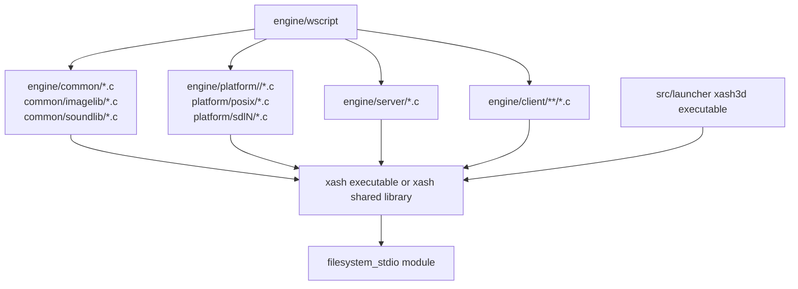
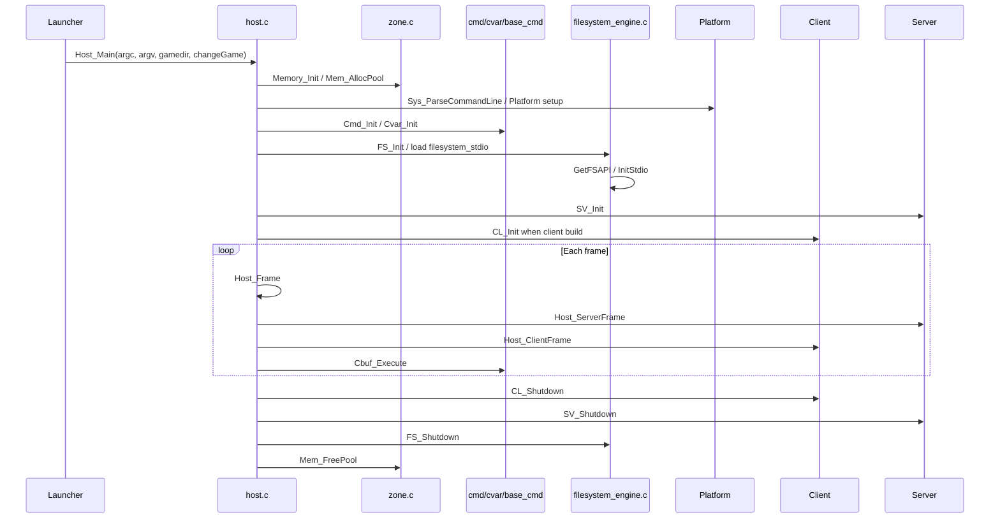

# Engine And Common Audit

## Scope

This audit covers `engine/` broadly and `engine/common/` in detail. It is a
first-pass orientation document for choosing the next modularization target
after the filesystem and launcher work.

The current Windows test-enabled configuration builds `engine` as the shared
library loaded by the launcher. `engine/wscript` constructs that target by
starting with `engine/common/**/*.c`, platform sources, and server sources, then
adding client sources when the client build is enabled.

## Scale

Approximate source scale from the current checkout:

| Area | Files | Lines | Notes |
| --- | ---: | ---: | --- |
| `engine/client/` | 92 | 51452 | Client state, prediction, renderer bridge, audio, input, UI, DLL integration. |
| `engine/common/` | 72 | 35365 | Host loop, memory, command/cvar, filesystem bridge, model loading, networking, console/logging, shared media loaders. |
| `engine/server/` | 16 | 19571 | Server lifecycle, game DLL bridge, physics, save/load, networking. |
| `engine/platform/` | 74 | 11728 | OS, dynamic library, crash, video/input/sound backend code. |

Largest flat `engine/common/` files:

| File | Lines | Primary Responsibility |
| --- | ---: | --- |
| `mod_bmodel.c` | 3943 | BSP loading, lumps, world model data, visibility, brush model support. |
| `net_encode.c` | 2009 | Delta tables, message bit packing, protocol encode/decode helpers. |
| `net_ws.c` | 1729 | Network sockets, address parsing, loopback, fakelag/loss, polling. |
| `net_chan.c` | 1625 | Network channels, fragmentation, reliable/sequence handling. |
| `con_utils.c` | 1305 | Console completion, map/config/save lists, config writing helpers. |
| `cmd.c` | 1283 | Command buffer, command registry, aliasing, scripting, command dispatch. |
| `host.c` | 1135 | Engine entry, host frame, shutdown/error handling, global host state. |
| `cvar.c` | 1132 | Console variable registry, mutation, filtering, config writing. |
| `mod_studio.c` | 1049 | Studio model loading, hitbox hull/cache support. |
| `hpak.c` | 897 | HPAK custom resource storage and console commands. |
| `net_buffer.c` | 867 | Bit/byte message buffer read-write helpers. |
| `common.h` | 813 | Central shared declarations and subsystem cross-links. |

Subfolders inside `engine/common/`:

| Folder | Files | Lines | Notes |
| --- | ---: | ---: | --- |
| `imagelib/` | 15 | 5589 | Image load/save/process helpers behind `FS_LoadImage`, `FS_SaveImage`, and related APIs. |
| `http/` | 1 | 1015 | Xash HTTP downloader, network/file integration, optional curl alternative in build script. |
| `soundlib/` | 2 | 520 | Shared sound decoding helpers used by common/client code. |

## Current Build Shape

The engine target is therefore a monolithic compilation unit at build-target
level even though source directories imply subsystems. Modernization should not
start by splitting the binary. It should first isolate internal ownership
behind smaller C-compatible service boundaries.

## Common Folder Roles

`engine/common/` is not one subsystem. It currently contains several runtime
services:

| Cluster | Main Files | Responsibility |
| --- | --- | --- |
| Host lifecycle | `host.c`, `host_state.c`, `launcher.c`, `dedicated.c` | `Host_Main`, frame timing, shutdown, error unwinding, state transitions, dedicated stubs. |
| Shared declarations | `common.h`, `system.h`, `library.h`, `protocol.h` | Broad public/internal declarations used by common, client, server, platform, and DLL bridges. |
| Memory | `zone.c` | Pool allocation, allocation sentinels, memory stats, `Z_*` macros through `host.mempool`. |
| Commands | `cmd.c`, `base_cmd.c`, `base_cmd.h`, `cfgscript.c`, `con_utils.c` | Command buffer, aliases, command/cvar shared lookup table, scripts, console completion. |
| Cvars | `cvar.c`, `cvar.h` | Console variable registry, mutation rules, filtering, server/userinfo propagation. |
| Console/logging | `sys_con.c`, `con_utils.c`, declarations in `common.h` and `system.h` | Console output, log file lifecycle, command completion output, config writing diagnostics. |
| Filesystem bridge | `filesystem_engine.c` | Loads `filesystem_stdio`, owns `g_fsapi`, forwards `FS_*`, passes engine memory/logging callbacks. |
| Dynamic libraries | `lib_common.c`, `library.h` | Library path selection, exported symbol lookup, save/restore symbol compatibility. |
| Networking | `net_ws.c`, `net_chan.c`, `net_buffer.c`, `net_encode.c`, `masterlist.c`, `ipv6text.c`, headers | Sockets, channels, bit buffers, protocol encoding, master server discovery. |
| Models/world | `model.c`, `mod_bmodel.c`, `mod_alias.c`, `mod_sprite.c`, `mod_studio.c`, `world.c`, `pm_trace.c`, `pm_surface.c`, `mod_local.h` | Model loading, BSP/studio/sprite parsing, trace hulls, world helpers, movement support. |
| Media helpers | `imagelib/`, `soundlib/`, `sounds.c` | Image/sound loading and processing shared by engine systems. |
| Resources | `hpak.c`, `custom.c` | Custom decals/resources and HPAK storage. |
| Utilities | `common.c`, `infostring.c`, `munge.c`, `whereami.c`, `ipv6text.c` | Parsing, download safety, random helpers, info strings, encoding, path discovery. |

## Central State

The dominant global is `host` in `host.c`, declared in `common.h` as
`host_parm_t host`. It mixes:

- frame timing and renderer-facing fields;
- global host status and game transition state;
- memory pools;
- command-line arguments;
- remote-console redirect state;
- platform window handle;
- startup/default game directory;
- config, console, cheat, userinfo, movevars, and renderinfo flags;
- client/server shared hull bounds and decal lists.

Other important common globals include:

| State | File | Notes |
| --- | --- | --- |
| `g_fsapi`, `FI`, filesystem handle | `filesystem_engine.c` | Engine-to-filesystem module bridge. |
| command buffers, alias list, command list | `cmd.c` | Command execution and registry state. |
| base command hash table | `base_cmd.c` | Shared lookup for commands, aliases, and cvars. |
| cvar list and pool | `cvar.c` | Ordered linked list plus command hash integration. |
| memory pool array | `zone.c` | Global pool table, indexed by integer handles. |
| network state | `net_ws.c`, `net_chan.c` | Sockets, channels, loopback/fakelag state, cvars. |
| model registry/cache | `model.c`, `mod_bmodel.c`, `mod_studio.c` | Loaded model table, BSP/studio scratch state, cache pools. |
| system log state | `sys_con.c` | Log path, FILE handle, colorization, final log footer. |

This is why a class-first rewrite would be risky. The first practical step is
to make service ownership explicit without changing the global storage model.

## Coupling Hotspots

### `common.h`

`common.h` is the largest coupling point. It includes low-level public headers,
platform/system headers, cvar declarations, renderer API declarations, model
types, and then declares many unrelated services in one place. It is used as a
precompiled mental model more than as a narrow contract.

Good future direction:

- split declarations into focused headers only after behavior is under test;
- preserve C ABI and existing include paths while introducing private service
  headers in `src/include/engine/`;
- avoid moving `host_parm_t` until callers are inventoried.

### Host Lifecycle

`host.c` owns `Host_Main`, `Host_Frame`, `Host_Error`, and shutdown. It directly
touches client, server, filesystem, command/cvar, model, input, video, tests,
platform timing, and dynamic library helpers.

The host lifecycle is a coordinator, not a good first extraction target. The
safer path is to carve out helpers that it calls, then leave `Host_Main` as the
legacy orchestration facade until much later.

### Command And Cvar Registry

`cmd.c`, `cvar.c`, and `base_cmd.c` already form a recognizable registry
system:

- `base_cmd.c` provides hash lookup by type;
- `cmd.c` owns command buffers, aliases, scripting, and dispatch;
- `cvar.c` owns cvar registration, mutation, filtering, and config output.

This is likely the best next modernization pilot. It is central enough to help
future work, but it has a clearer data model than host lifecycle. It also has
some existing engine tests behind `XASH_ENGINE_TESTS`, and it can gain unit
tests around command/cvar behavior without rendering or networking.

### Console And Logging

`sys_con.c` owns stdout/log file output, while `Con_Printf`,
`Con_DPrintf`, `Con_Reportf`, and `Log_Printf` declarations live in
`common.h` and are called from almost every common cluster. The filesystem
module receives these callbacks through `filesystem_engine.c`.

This confirms the earlier filesystem logging decision: filesystem logging
should stay deferred until engine console/logging ownership is audited and
refactored. The correct home is engine common, not filesystem.

### Filesystem Bridge

`filesystem_engine.c` is already a boundary wrapper:

- loads `filesystem_stdio`;
- resolves `GetFSAPI` and `CreateInterface`;
- stores `g_fsapi`;
- forwards simple `FS_*` calls;
- registers filesystem cvars and commands;
- passes memory/logging/system callbacks to the filesystem module.

This file is a good candidate for documentation and light adapter cleanup, but
not a high-value next migration because the filesystem internals were already
moved substantially.

### Platform Leakage

`system.c` still contains platform branches and a comment noting some code has
not moved to the platform directory yet. It wraps `Platform_*` APIs but also
uses `#if XASH_WIN32`, `XASH_POSIX`, `XASH_PSVITA`, and others directly.

This resembles the launcher work: a later phase can move platform-specific
logic under `engine/platform/` while keeping `Sys_*` as the common facade.

### Networking And Models

Networking and model loading are large but behavior-sensitive. They are poor
first targets for structural migration:

- network code has protocol compatibility and timing edge cases;
- model/BSP loading has many binary format quirks and renderer/server/client
  assumptions;
- both are good candidates for tests and documentation before any code moves.

## Initialization Sketch

## Modernization Recommendations

### Recommended Next Pilot: Command/Cvar Core

Start with command/cvar infrastructure rather than host lifecycle or logging.
Reasons:

- It is already registry-shaped (`base_cmd.c` is close to a generic registry).
- It is heavily used by engine systems, so better structure helps later phases.
- It has behavior that can be tested without launching the full game.
- It can reuse lessons from the generic registry and debug utilities.

Suggested first tasks:

1. Document exact command/cvar ownership and lifecycle.
2. Add focused tests for duplicate command/cvar names, alias behavior,
   privileged/filterable handling, command buffer overflow behavior, and cvar
   write/reset behavior.
3. Introduce an internal C++ registry/helper behind the existing C functions.
4. Keep `Cmd_*`, `Cvar_*`, `Cbuf_*`, and `BaseCmd_*` exports callable from C.
5. Defer user-visible console formatting changes until after behavior tests.

### Second Pilot: Console/Logging Policy

Once command/cvar ownership is clearer, audit console/logging:

- identify where `Con_Printf`, `Con_DPrintf`, `Con_Reportf`, `Log_Printf`,
  `Sys_Print`, and `Sys_PrintLog` are defined and called;
- define release/debug log categories and sinks;
- decide how modern debugging utilities should feed into engine output;
- then resume deferred filesystem logging work.

### Later Candidates

- `system.c` platform leakage into `engine/platform/` facades.
- `filesystem_engine.c` adapter cleanup after console/logging decisions.
- `imagelib/` or `soundlib/` as self-contained media utility modules.
- networking and model loading only after targeted behavior tests exist.

## Immediate Risks To Respect

- `host` is shared everywhere and should not be mechanically wrapped without
  caller inventory.
- `common.h` changes can rebuild or break nearly everything.
- Command/cvar filtering affects security and multiplayer behavior.
- Console/log output is used for tests, diagnostics, crash paths, and user
  scripts.
- Filesystem callbacks depend on engine memory and fatal-error semantics.
- Network/model code has compatibility constraints that are not obvious from
  function names alone.
