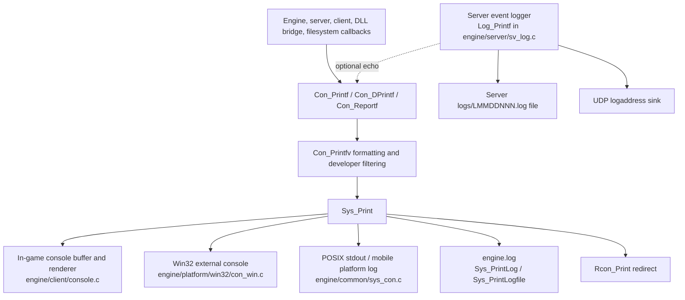

# Console And Logging Baseline

## Purpose

This document maps where engine console output currently lives. It separates
the rendered Half-Life style in-game console from the external operating-system
console window, engine log file, rcon forwarding, and multiplayer server event
logs.

This distinction matters for Phase 43 because the filesystem and future modern
debugging utilities should feed the engine output layer without taking ownership
of console UI, platform windows, or log-file lifecycle.

## High-Level Topology

`Log_Printf` is not just another name for `Con_Printf`. It owns the multiplayer
server event/frag log path and only echoes to the normal console when server log
cvars request that behavior.

## Initialization Order

`Host_Main` initializes console and logging early:

1. `Sys_InitLog()` opens `engine.log` when `-log` is present and sets timestamp
   behavior from `-logtime`.
2. `Con_Init()` initializes the in-game console for non-dedicated builds. The
   dedicated build provides a stub in `engine/common/dedicated.c`.
3. `Platform_Init()` later creates platform services. On Win32, this calls
   `Win32_Init()`, which calls `Wcon_CreateConsole()`.
4. `FS_Init()` then loads the filesystem module and passes engine print
   callbacks through `fs_interface_t`.

Early messages can therefore reach `engine.log` before the Win32 external
console exists. The Win32 sink tolerates that because `Wcon_WinPrint()` returns
when no console window is attached or allocated.

## Print Entry Points

`engine/common/sys_con.c` owns the exported print entry points:

| Function | Current filter | Notes |
| --- | --- | --- |
| `Con_Printf` | Requires `host.allow_console`. | General engine/user output. |
| `Con_DPrintf` | Requires `host_developer >= DEV_NORMAL`. | Debug output. It also drops the known `0\n` HLRally spam case. |
| `Con_Reportf` | Requires `host_developer >= DEV_EXTENDED`. | Extended diagnostic/report output. |

All three route through `Con_Printfv()`, which formats into a static
`MAX_PRINT_MSG` buffer, sends the result to `Sys_Print()`, and emits an extra
newline if formatting overflowed.

Compatibility notes:

- The public varargs C functions are declared in `engine/common/common.h` and
  exported through several engine-facing interfaces.
- The implementation uses static buffers and static line-state, so it currently
  assumes main-thread style usage.
- Callers pass GoldSrc/Xash color and control prefixes directly in the text.
  Sinks decide how much of that to preserve, strip, or translate.

## System Fanout

`engine/common/system.c` owns `Sys_Print()`. It is the main fanout point after
formatting and filtering:

- In non-dedicated builds, it calls `Con_Print()` so the rendered in-game console
  receives the message.
- On Win32, it normalizes line endings, drops pseudo-graphic console separator
  bytes, skips selected one-byte control prefixes, and calls `Wcon_WinPrint()`.
- It always calls `Sys_PrintLog()` for stdout/mobile logging and `engine.log`.
- It calls `Rcon_Print()` so remote console redirection can see the text.

Fatal paths also use this layer. `Sys_Error()` prints the final error message
after server error handling, adjusts Win32 console visibility depending on
dedicated/non-dedicated mode, shows a platform message box for non-dedicated
builds, then quits through host shutdown.

## In-Game Console

`engine/client/console.c` owns the Half-Life style rendered console:

- `Con_Init()` registers console cvars and commands, allocates the scrollback
  buffer, initializes edit fields and chat fields, and prints
  `Console initialized.`
- `Con_Print()` appends text to the console ring buffer, handles wrapping,
  carriage-return replacement behavior, notify timing, and color-prefix aware
  character counting.
- `Con_DrawConsole()`, `Con_DrawNotify()`, `Con_DrawSolidConsole()`, and
  related helpers render the console and notification lines.
- `Con_NPrintf()` and `Con_NXPrintf()` draw temporary debug notify lines.
- `toggleconsole`, `clear`, `messagemode`, `messagemode2`, and `contimes` live
  here because they are UI/input behavior, not log sinks.

This module should not own platform stdout, file logging, rcon output, or
filesystem callbacks. It is the rendered client-facing sink.

Dedicated builds do not initialize this console. They use the dedicated stubs in
`engine/common/dedicated.c`, so output goes through platform/stdout/log paths.

## External Platform Console

The external console the user can see on Windows is the Win32 console path in
`engine/platform/win32/con_win.c`:

- `Wcon_CreateConsole()` attaches to the parent console when possible. If it
  cannot attach, it allocates a console for dedicated servers or sufficiently
  verbose developer runs.
- Normal non-dedicated startup with developer level `0` may skip creating it.
- The console has its own input buffer, command history, tab completion hook,
  status line, and a dedicated-only `clear` command.
- `Wcon_Input()` returns command lines to `Platform_Input()` for dedicated
  console input.
- `Wcon_DestroyConsole()` restores attached console settings or hides/frees an
  allocated console during shutdown.

POSIX does not have an equivalent GUI window layer. `engine/platform/posix`
provides `Posix_Input()` for dedicated server stdin, while stdout text is
written by `Sys_PrintStdout()` in `sys_con.c`. Mobile platforms route stripped
console text into their platform logging APIs where available.

## Engine Log File

`engine/common/sys_con.c` owns the engine log file:

- `Sys_InitLog()` opens `engine.log` only when `-log` is present.
- `Sys_PrintLog()` tracks whether a new line is starting, adds short stdout
  timestamps, and adds full `engine.log` timestamps when `-logtime` is enabled.
- `Sys_PrintLogfile()` writes to the file descriptor without using engine
  allocation or `Con_Printf`, strips or translates color escapes, and flushes.
- `Sys_CloseLog()` writes a shutdown footer with stop reason, build metadata,
  and a timestamp before closing the log.

This path is intentionally low-level. Fatal and crash paths can call it when
large parts of the engine may be unstable.

## Server Event Log

`engine/server/sv_log.c` owns multiplayer server event logging:

- `Log_Open()` chooses a `logs/LMMDDNNN.log` file through the filesystem API.
- `Log_Printf()` prepends server log timestamps, optionally sends UDP log
  packets, optionally echoes to the normal console with `Con_Printf()`, and
  writes to the server log file with `FS_Printf()`.
- `Log_Close()` closes the server log file.

This is separate from `engine.log`. A modernization pass should keep that
separation unless a later design explicitly introduces a shared sink registry
with distinct channels.

## External Interfaces

Console output is exposed broadly:

- `engine/common/common.h` declares `Con_Printf`, `Con_DPrintf`,
  `Con_Reportf`, `Log_Printf`, `Con_Print`, and notify print helpers.
- `engine/cdll_int.h` and `engine/menu_int.h` expose print callbacks to client
  and menu code.
- `engine/server/sv_pmove.c` assigns `Con_Printf` and `Con_DPrintf` to the
  movement API.
- `engine/common/filesystem_engine.c` passes `Con_Printf`, `Con_DPrintf`, and
  `Con_Reportf` to the filesystem module through `fs_interface_t`.

The stable C surface is therefore a compatibility boundary. Future C++ code
should sit behind these functions, not replace their signatures first.

## Migration Risks

- Do not merge rendered-console state with platform/log sinks. They have
  different lifetimes and build availability.
- Do not make filesystem or debugging utilities depend on `host`,
  `host_developer`, or in-game console globals.
- Preserve color/control prefix behavior until tests prove the exact intended
  compatibility rules.
- Preserve line-start timestamp behavior for `Sys_PrintLog()`.
- Treat fatal and crash paths as allocation-sensitive. They should keep a
  direct low-level log path even if normal output later uses richer sinks.
- Assume current output APIs are not thread-safe. Any future thread-aware path
  should queue immutable messages and drain them on the engine thread unless a
  sink is explicitly made safe.
