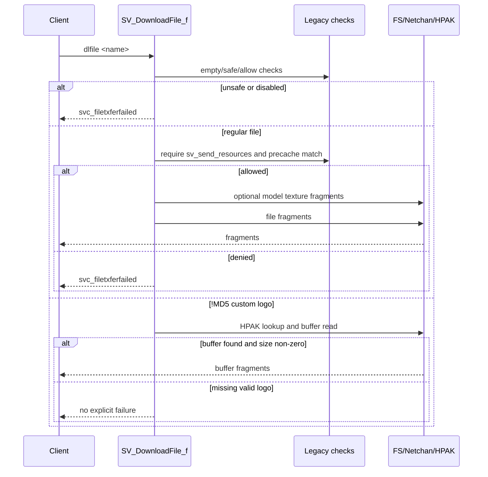

# Custom Resource And Download Baseline

Phase 61 audits the server-side resource and download path before extracting
more helpers into `src/engine/server`. The main files are:

- `engine/common/custom.c`: shared customization creation, custom decal loading,
  cleanup, and resource-list sizing.
- `engine/server/sv_custom.c`: server resource lists, consistency checks,
  custom upload requests, customization propagation, and resource-list messages.
- `engine/server/sv_client.c`: the `dlfile` client command path in
  `SV_DownloadFile_f()` and incoming client resource-list parsing.

## Compatibility Data

`resource_t` and `customization_t` are declared in `engine/custom.h` and are
ABI-sensitive because game DLL-facing callbacks and legacy protocol code pass
them around directly.

Important `resource_t` fields:

| Field | Behavior |
| --- | --- |
| `szFileName[64]` | Fixed-size resource name used by precache, downloads, and HPAK. |
| `type` | `t_sound`, `t_skin`, `t_model`, `t_decal`, `t_generic`, `t_eventscript`, or fake `t_world`. |
| `nIndex` | Precache/decal index. |
| `nDownloadSize` | Download or upload size; server rejects client resource-list entries over 1 GiB. |
| `ucFlags` | Compatibility flags such as `RES_FATALIFMISSING`, `RES_WASMISSING`, `RES_CUSTOM`, and `RES_CHECKFILE`. |
| `rgucMD5_hash[16]` | Custom resource identity for `!MD5...` paths and HPAK lookup. |
| `pNext`/`pPrev` | Intrusive resource-list links. |

The fixed struct layout should remain legacy-owned while migration is in
progress. Modern helpers can consume snapshots or plain value records, but
should not expose replacement C++ resource objects across the game DLL boundary.

## Shared Customization Helpers

`COM_CreateCustomization()`:

- allocates a `customization_t` with `Z_Calloc`;
- copies the input `resource_t`;
- rejects resources with `nDownloadSize <= 0`;
- loads bytes either from `custom.hpk` through `HPAK_GetDataPointer()` when
  `FCUST_FROMHPAK` is set, or from the filesystem through `FS_LoadFile()`;
- verifies file-backed customizations by comparing loaded size to
  `nDownloadSize`;
- for `RES_CUSTOM` decals, validates the data through the image loader;
- accepts decal payloads only within `HPAK_ENTRY_MIN_SIZE` and
  `HPAK_ENTRY_MAX_SIZE` before marking them translated;
- optionally loads `pInfo` unless `FCUST_WIPEDATA` is set;
- links the customization at the head of the caller-supplied customization list.

`CustomDecal_LoadImage()` chooses a fake test name based on extension:

- `.png` becomes `#logo.png`;
- `.wad` becomes `#logo.wad`;
- every other extension becomes `#logo.bmp`.

It sets `IL_LOAD_PLAYER_DECAL` and uses `FS_LoadImage()`, so image validation
and renderer image lifetime are not pure server logic.

`COM_ClearCustomizationList()` frees `pBuffer`, optionally removes decal state
through the renderer when client-side rendering is active, frees `pInfo`, and
then frees each list node.

`COM_SizeofResourceList()` sums `nDownloadSize` across an intrusive resource
list and also fills a per-type summary. `t_model` with `nIndex == 1` is reported
under the fake `t_world` bucket.

## Server Resource Lists

`sv_custom.c` uses intrusive circular `resource_t` lists:

- `resourcesneeded`: resources the peer says are needed or missing;
- `resourcesonhand`: resources that are available and can be propagated.

Server list helpers are minimal:

- `SV_AddToResourceList()` refuses already-linked nodes and appends before the
  sentinel.
- `SV_RemoveFromResourceList()` unlinks without validating corrupted links.
- `SV_MoveToOnHandList()` moves a node from its current list to
  `resourcesonhand`.
- `SV_ClearResourceList()` unlinks and frees every node, then resets the
  sentinel.

Client code has similar list helpers in `engine/client/cl_custom.c`, but the
client variants perform additional corruption checks. That duplication is a
future shared-helper opportunity, not part of Phase 61.

## Server Download Command

`SV_DownloadFile_f()` handles the client `dlfile` command.

Decision order:

1. Missing argument or empty name returns success without sending a failure.
2. `COM_IsSafeFileToDownload(name)` must pass and `sv_allow_download` must be
   non-zero, or `svc_filetxferfailed` is sent through `SV_FailDownload()`.
3. Names that do not begin with `!` are regular filesystem downloads.
4. Regular downloads require `sv_send_resources` and a match in
   `sv.resources[]`; otherwise the server sends failure.
5. Sound resources compare against the requested name after blindly advancing
   the comparison pointer by the length of `sound/`. In normal use this removes
   a `sound/` prefix, but the code does not first verify that the prefix is
   present.
6. A requested `.mdl` may send `Mod_StudioTexName(name)` first when that texture
   sidecar exists.
7. The actual file is sent with `Netchan_CreateFileFragments()` and
   `Netchan_FragSend()`; if fragment creation fails, the server sends failure.
8. Names beginning with `!` are accepted only as `!MD5` custom-logo requests
   when the name length is 36 and `sv_send_logos` is non-zero.
9. Custom-logo requests use `COM_HexConvert()`, `HPAK_ResourceForHash()`, and
   `HPAK_GetDataPointer()`. Non-zero buffers are sent with
   `Netchan_CreateFileFragmentsFromBuffer()`, then freed with `Mem_Free()`.
10. Invalid custom-logo names, disabled logo sends, or non-`!MD5` bang paths
    send failure. A syntactically valid custom-logo request whose HPAK lookup
    fails currently returns without sending an explicit failure.

## Safe Download Names

`COM_IsSafeFileToDownload()` is shared in `engine/common/common.c` and is an
important dependency for server download policy.

For `!MD5` names:

- the prefix check is case-sensitive and must be exactly `!MD5`;
- the name must be extensionless and exactly 36 characters long;
- only uppercase `A-F` hex is accepted; lowercase hex is rejected.

For regular names:

- every character must be printable;
- slashes are not normalized here;
- backslash, colon, tilde, and `..` are rejected after lowercase conversion;
- names beginning with `/` are rejected;
- a dot extension is required;
- the final extension length must be exactly four characters including the dot;
- `cfg`, `lst`, `ini`, `log`, `exe`, `vbs`, `com`, `bat`, `dll`, `sys`, `ps1`,
  `so`, `sh`, `dylib`, `apk`, and `ipa` are banned.

The early safe-name gate means `SV_DownloadFile_f()`'s later case-insensitive
`!MD5` check only runs for names that already passed the stricter uppercase
safe-name rule.

## Client Resource List Upload

`SV_ParseResourceList()` reads a client-provided resource list:

1. clears `resourcesneeded` and `resourcesonhand`;
2. allocates one `resource_t` per entry;
3. reads name, type, index, size, flags, and optional MD5 hash;
4. clears `RES_WASMISSING`;
5. rejects the entire list if `type > t_world` or size is over 1 GiB;
6. rejects too-frequent updates using `resourcelist_next_changetime`;
7. computes total size with `COM_SizeofResourceList()`;
8. if uploads are enabled, estimates missing custom decals with
   `SV_EstimateNeededResources()`;
9. clears both lists if the missing total exceeds `sv_uploadmax` MiB;
10. sets `upstate = us_processing`;
11. calls `SV_BatchUploadRequest()`.

`SV_EstimateNeededResources()` only considers decal resources. Missing custom
decals are identified by absence from `custom.hpk`; non-zero sizes set
`RES_WASMISSING` and contribute to the upload total, while zero-sized missing
entries increment a local counter that is not returned.

`SV_BatchUploadRequest()` moves non-missing resources to `resourcesonhand`. For
missing custom decals it builds `!MD5<hash>` and calls `SV_CheckFile()`.

`SV_CheckFile()`:

- returns true when the named HPAK resource already exists;
- returns true without requesting upload when `sv_allow_upload` is false;
- otherwise writes a client `upload "!MD5<hash>"` command and returns false.

`SV_UploadComplete()` creates customization objects, calls the game DLL
`pfnPlayerCustomization()` callback, propagates customizations to other spawned
clients, and marks upload state complete.

## Resource Message Serialization

`SV_SendResources()` writes the server-side resource list into the reliable
startup/resource message stream:

1. starts `svc_resourcerequest`;
2. writes `svs.spawncount`;
3. writes a reserved long zero;
4. optionally writes `svc_resourcelocation` and `sv_downloadurl` when the URL
   is non-empty and shorter than 256 characters;
5. starts `svc_resourcelist`;
6. writes `sv.num_resources` with `MAX_RESOURCE_BITS` (`13`) bits;
7. writes each resource row with `SV_SendResource()`;
8. appends the consistency list with `SV_SendConsistencyList()`.

`SV_SendResource()` row wire layout:

| Field | Encoding |
| --- | --- |
| `type` | unsigned 4 bits. |
| `szFileName` | null-terminated string bytes. |
| `nIndex` | unsigned `MAX_MODEL_BITS` (`12`) bits. |
| `nDownloadSize` | signed 24 bits using legacy `MSG_WriteSBitLong()` sign-last encoding. |
| `ucFlags` | unsigned 3 bits, masked to `RES_FATALIFMISSING | RES_WASMISSING`. |
| `rgucMD5_hash` | 16 raw bytes, only when `RES_CUSTOM` is set in the original flags. |
| reserved-present bit | one bit; true when `rguc_reserved[32]` is not all zero. |
| `rguc_reserved` | 32 raw bytes, only when the reserved-present bit is true. |

The row writer does not write the surrounding server command byte, resource
count, resource-location URL, consistency records, or netchan fragments.

## HPAK And Temp Files

The server-side custom resource path depends on `engine/common/hpak.c`, but HPAK
is a broader shared system rather than a pure server subsystem.

Relevant behavior:

- `hpk_custom_file` defaults to `custom.hpk`.
- `HPAK_GetDataPointer()` can return a newly allocated buffer that callers must
  free with `Mem_Free()`.
- `HPAK_AddLump()` verifies MD5 before writing a lump.
- `HPAK_RemoveLump()` rewrites the archive through a `.hp2` temporary file,
  deletes invalid temp output on error, deletes the original archive when the
  last element is removed, and renames the temp file back to `.hpk`.

HPAK file I/O, temp-file replacement, and archive integrity checks should stay
legacy-owned until a dedicated HPAK migration phase.

## Boundary Risks

- `resource_t` layout is stable compatibility data.
- `SV_DownloadFile_f()` mixes pure policy with `FS_*`, `Netchan_*`, HPAK, and
  cvar reads.
- `SV_ParseResourceList()` allocates and frees legacy list nodes while reading
  wire data.
- Customization creation loads and validates images, may touch renderer state,
  and calls game DLL customization callbacks.
- Consistency checks depend on model bounds, MD5 file hashing, and game DLL
  `pfnInconsistentFile()`.

The safest next step is to extract target-neutral resource identity and
download-policy decisions without moving list memory ownership, HPAK I/O,
netchan fragment creation, or game DLL callbacks.
