# Legacy Filesystem Architecture

## Purpose

The current filesystem is not just a file abstraction. It is the engine's
virtual filesystem, mod discovery system, archive mounting layer, case
compatibility layer, DLL path resolver, and compatibility adapter for
Valve-style filesystem consumers.

It is implemented as a shared library target named `filesystem_stdio`. The
engine loads that module at runtime and talks to it through a C function table.
The module also exposes `VFileSystem009` for code that expects the older
Valve-style C++ interface.

## Module Map

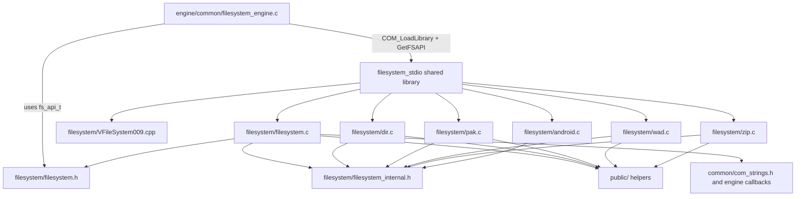

## Exported Interfaces

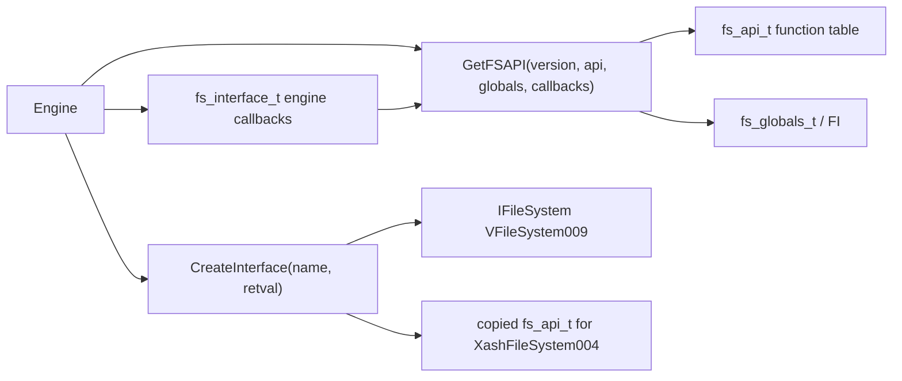

The C API boundary is the primary engine boundary. `VFileSystem009` is a C++
compatibility wrapper that mostly delegates back to C `FS_*` functions.

Keep stable:

- `GET_FS_API`
- `FS_API_VERSION`
- `FS_API_CREATEINTERFACE_TAG`
- `FILESYSTEM_INTERFACE_VERSION`
- `fs_api_t`
- `fs_globals_t`
- `fs_interface_t`
- `search_t` ownership expectations
- `file_t` opacity outside filesystem internals

## Core State

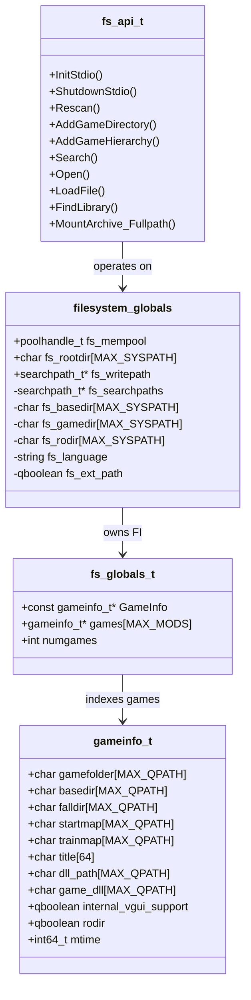

Most state is process-global inside `filesystem.c`. Modernization should first
wrap this state conceptually, then mechanically, and only later move storage.

## Search Path Object Model

`searchpath_t` is the central legacy object. It combines metadata, backend
storage, a linked-list pointer, and a callback table.

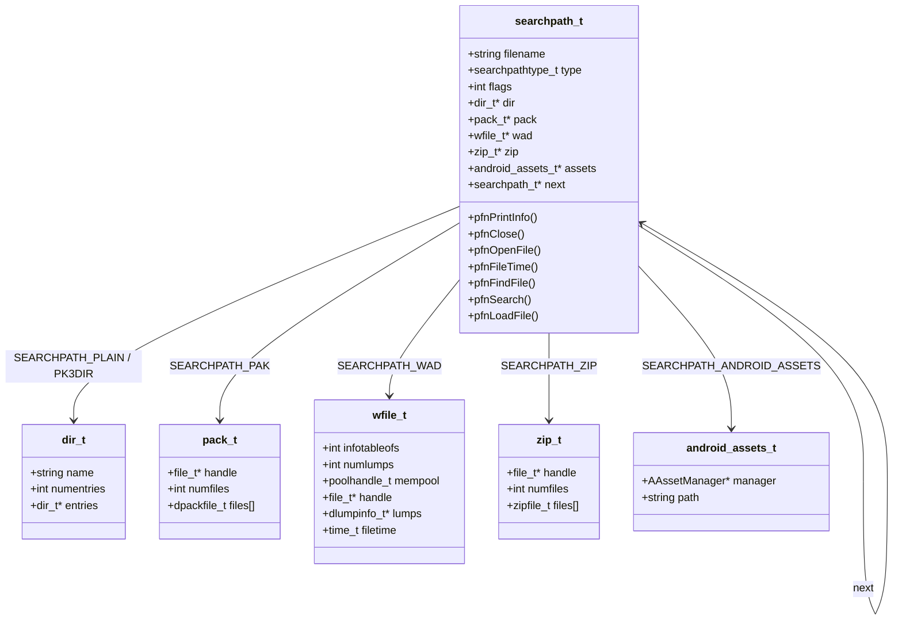

This is already a manual object model. The callback table is the current
polymorphic seam.

## Backend Callback Matrix

| Callback | Directory | PAK | WAD | ZIP/PK3 | Android Assets |
| --- | --- | --- | --- | --- | --- |
| Print info | yes | yes | yes | yes | yes |
| Close | yes | yes | yes | yes | yes |
| Open file | yes | yes | yes | yes | yes |
| File time | yes | yes | yes | yes | yes |
| Find file | yes | yes | yes | yes | yes |
| Search | yes | yes | yes | yes | yes |
| Load file | default via open/read | default via open/read | custom lump load | custom ZIP load | custom asset load |

The directory backend is the best first modernization pilot because it has a
clear cache object and already has a case-insensitive behavior test.

## File Handle Model

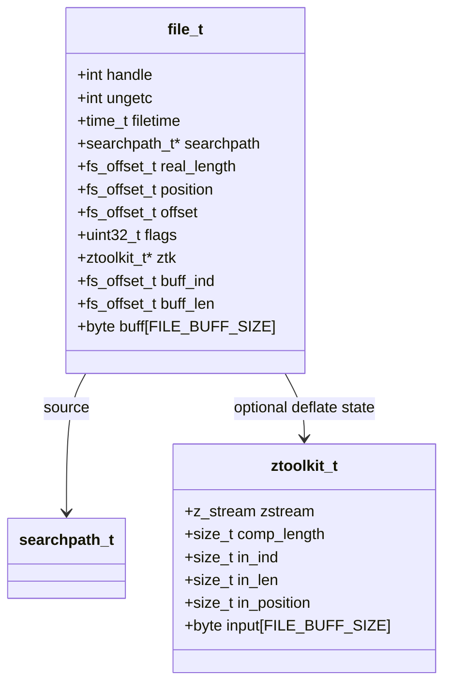

`file_t` is opaque in the public header but fully defined in
`filesystem_internal.h`. It represents direct disk files, package slices, and
compressed streams.

## Startup Sequence

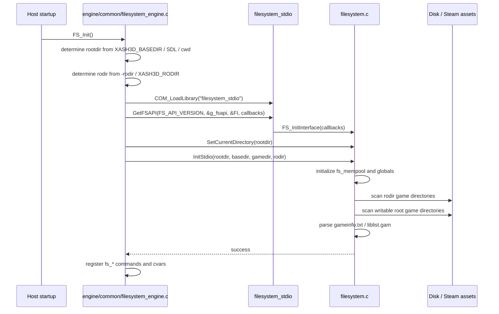

## Game Load And Rescan Sequence

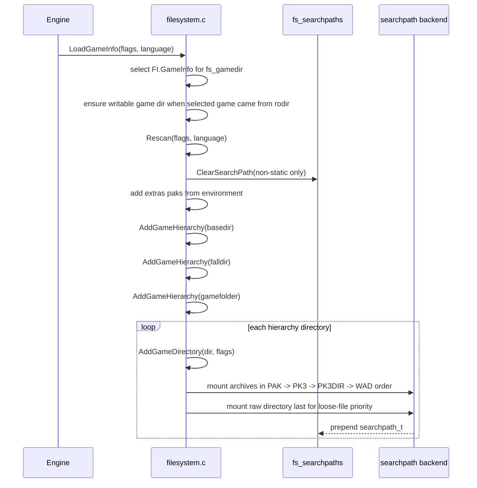

Important behavior: raw directories are mounted after archives but prepended to
the search chain, so loose files get priority over packed files in that game
directory.

## Read Sequence

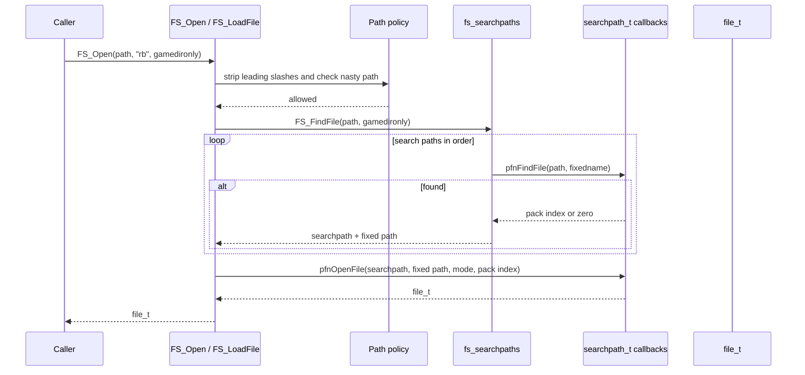

`FS_LoadFile` follows the same search path lookup, then either calls a backend
`pfnLoadFile` override or opens and reads through `file_t`.

## Write Sequence

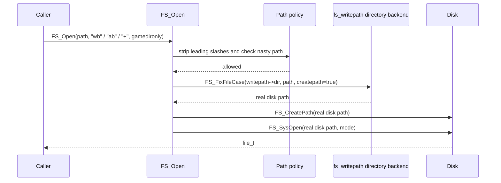

Writes do not walk all search paths. They target the current write path.

## DLL Lookup Sequence

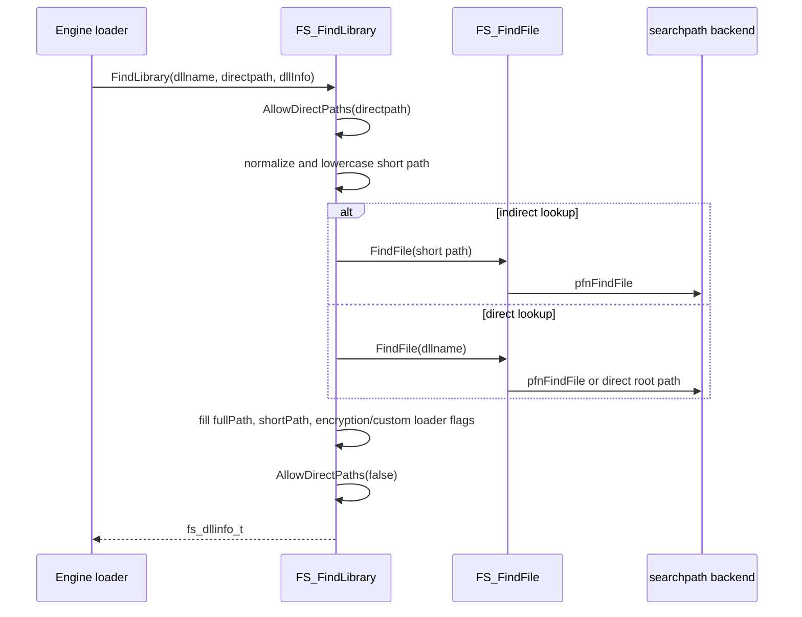

This flow is compatibility-sensitive because game and client DLL loading
depends on exact search path and rodir behavior.

## Directory Backend Sequence

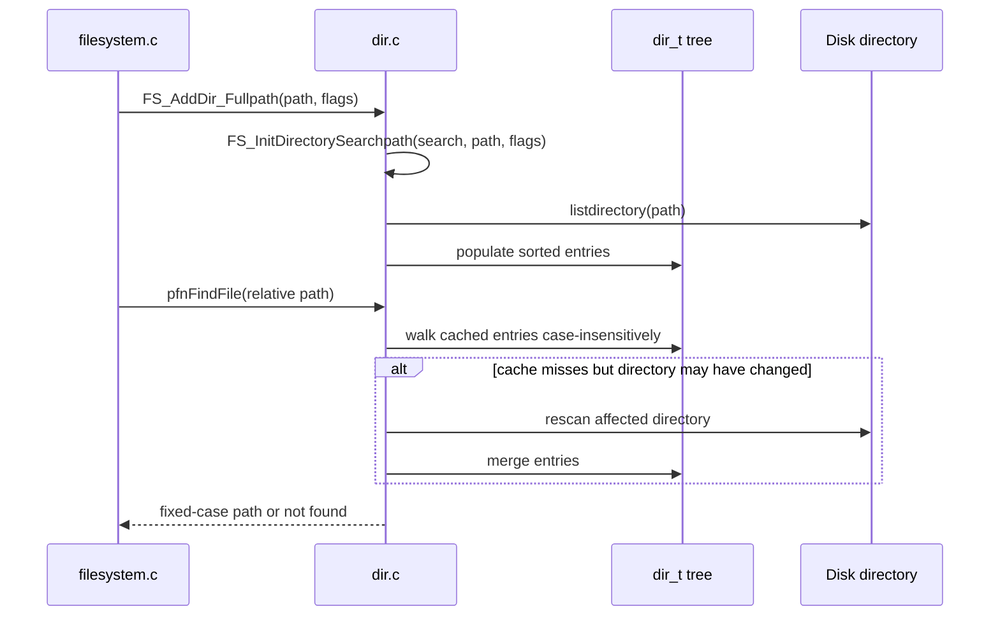

This backend is a good first C++ pilot because `dir_t` is already a private
object graph with clear lifecycle and behavior.

## Archive Mount Sequence

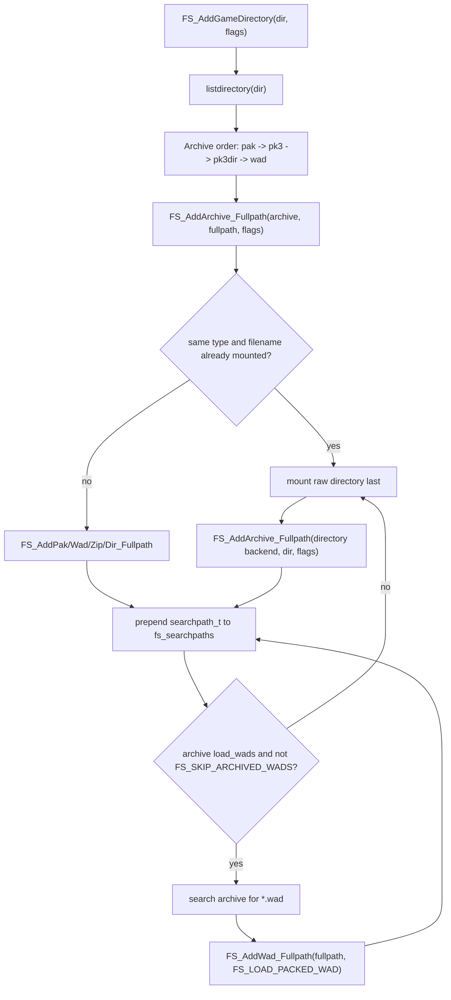

## Behavior Hotspots

These areas should be documented and tested before modernization changes them:

- `FS_AddGameHierarchy` mount order and recursive basedir handling.
- `rodir` overlay behavior between read-only Steam assets and writable root.
- Loose-file precedence over archives.
- PAK, PK3, PK3DIR, WAD archive mount order.
- WADs discovered inside PAK/PK3 archives.
- `gamedironly` filtering through `FS_GAMEDIRONLY_SEARCH_FLAGS`.
- Direct path escape behavior and the special `../` strip.
- Case-insensitive directory cache refresh.
- `FS_FindLibrary` short path casing and full path resolution.
- `FS_LoadFile` versus `FS_LoadFileMalloc` allocator ownership.
- No-init behavior tested by `tests/filesystem/no-init.c`.

## Modernization Reading Notes

The most promising legacy boundaries are:

- `searchpath_t` callback table as the first adapter seam.
- `dir_t` cache as the first private object to wrap.
- `g_archives` and `FS_AddArchive_Fullpath` as a future archive registry.
- `FS_AddGameHierarchy` as a future game hierarchy builder, after tests.
- `FS_CheckNastyPath` and `FS_AllowDirectPaths` as a future path policy, after
  tests.

The least safe early moves are:

- changing `fs_api_t`
- changing `VFileSystem009`
- moving `gameinfo_t` parsing or hierarchy order
- changing allocator ownership
- changing DLL lookup behavior
