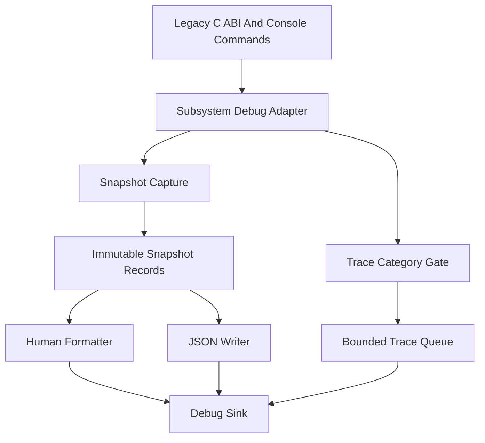
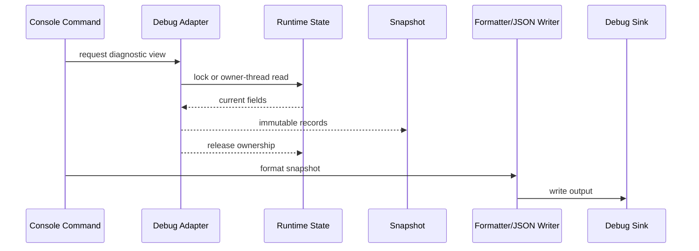
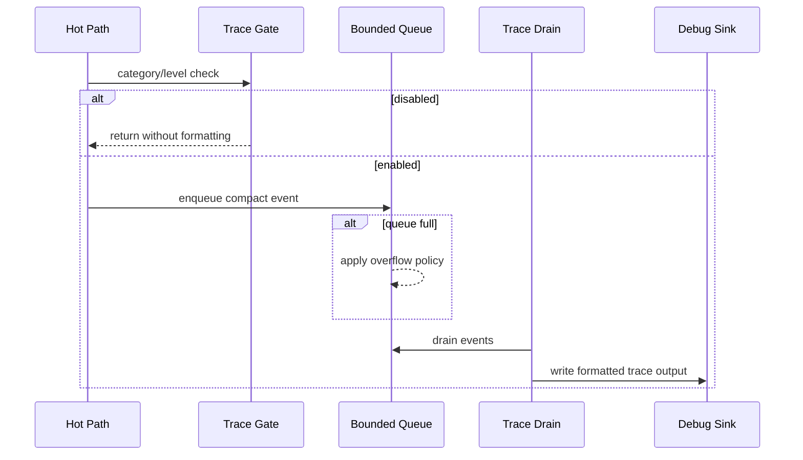

# Debugging Utility Architecture

## Purpose

The modern debugging utility layer provides reusable diagnostics for the
rewrite without making each subsystem invent its own logging, snapshot,
serialization, trace, and threading conventions.

Filesystem diagnostics are the first consumer, but the architecture is meant to
work for renderer state, platform services, resource loading, commands/cvars,
networking, UI, and future developer tooling.

## Source Layout

Planned source homes:

| Path | Role |
| --- | --- |
| `src/include/debugging/` | Private C++ headers for the shared debugging contracts. |
| `src/debugging/` | Implementation files for formatters, writers, sinks, and trace queues. |
| `tests/debugging/` | Future focused tests for reusable debugging utilities. |
| `tests/filesystem/` | Filesystem-specific tests that consume the debug utilities during the pilot. |

These folders are build-wired through `src/wscript` for the first tested shared
debugging slice. New code should still arrive as small, tested increments
rather than as a full framework drop.

The concrete proposed namespace and class list lives in
[api-inventory.md](api-inventory.md).

## Architectural Principles

- Runtime objects expose capture operations, not formatting methods.
- Capture creates immutable snapshot records.
- Human formatting and JSON writing consume the same snapshot records.
- Output sinks own platform-specific delivery details.
- Trace events are gated and cheap when disabled.
- Async paths are bounded and report dropped events.
- Public C ABI and SDK headers do not expose modern utility types.
- Third-party libraries stay behind private facades.

## Layer Diagram



## Component Roles

### Snapshot Records

Snapshot records are immutable, copyable descriptions of runtime state.

Responsibilities:

- describe one diagnostic view at one moment
- own or reference stable string storage
- include schema/version metadata for machine-readable output
- avoid pointers into mutable runtime containers unless lifetime is guaranteed

Non-responsibilities:

- no runtime mutation
- no console output
- no JSON string construction
- no subsystem policy decisions

Example:

```cpp
namespace xash::debugging
{
struct SnapshotHeader
{
    const char *schema;
    uint32_t schemaVersion;
    uint64_t sequence;
    uint64_t timestampUsec;
};
}
```

Filesystem-specific records should live near the filesystem adapter until the
shape is proven reusable.

### Capture Adapters

Capture adapters know how to read subsystem state safely.

Responsibilities:

- hold a short lock or run on the subsystem owner thread
- copy the fields needed for diagnostics
- release ownership before formatting or writing output
- return explicit status if capture fails

Non-responsibilities:

- no long-running archive scans while holding global locks
- no output formatting
- no allocation-heavy JSON generation inside critical sections

For the filesystem pilot, the capture adapter can initially walk the existing
`searchpath_t` list on the owning thread. A later implementation can capture
from an immutable search-path snapshot without changing command output.

### Human Formatters

Human formatters turn snapshot records into developer-facing text.

Responsibilities:

- produce readable console output
- keep ordering deterministic
- include enough context to diagnose path, backend, and policy issues
- avoid querying runtime state while formatting

Human text can evolve, but it should remain stable enough to be useful in bug
reports and manual comparisons.

### JSON Writers

JSON writers emit machine-readable output from the same records.

Responsibilities:

- include a schema name and version
- keep field names stable once tests depend on them
- emit explicit fields rather than parsing-friendly prose
- escape strings correctly

The current implementation is `xash::debugging::json::JsonWriter`, a small
streaming writer over `IDebugSink`. It supports objects, arrays, field names,
strings, unsigned/signed integer values, booleans, and null values.

RapidJSON is deferred for now. It is still a reasonable future candidate, but
the first filesystem diagnostics need deterministic JSON generation more than
parsing, DOM mutation, or a broad third-party dependency. If snapshot
serialization grows into nested, schema-heavy structures, the writer facade is
the replacement boundary.

### Debug Sinks

Sinks deliver final text.

Expected sinks:

- console sink
- test buffer sink
- file sink later if useful
- tooling or pipe sink later if needed

Sinks are the correct place for platform-specific output behavior. Snapshot
capture and formatters should remain platform-neutral.

### Trace Gates

Trace gates decide whether high-volume diagnostics are enabled before work is
done.

Responsibilities:

- check category and level quickly
- avoid expensive formatting when disabled
- make release-build behavior explicit
- support compile-time and runtime gating

Trace categories should be subsystem-owned but represented through shared
debugging types.

Initial trace support now includes `TraceLevel`, `TraceCategory`,
`TraceEvent`, `TraceQueueStats`, and `TraceGate`. The gate is synchronous and
does not enqueue events; bounded async buffering remains deferred until a real
producer needs it.

Compile-time macro policy is recorded in
[trace-gating-policy.md](trace-gating-policy.md), but macros are not
implemented yet.

### Trace Queue

The trace queue stores high-volume events when synchronous output would be too
expensive or unsafe.

Responsibilities:

- bounded capacity
- explicit overflow policy
- dropped-event counters
- shutdown flush or discard policy
- no indefinite blocking on the main thread

The initial implementation can be synchronous. A queue should be added only
when a real trace producer needs it.

## Data Flow

### Command Snapshot Flow



### Trace Flow



## Threading Model

### Initial Model

The initial model is synchronous and owner-thread friendly:

- commands run on the main/engine thread
- capture reads existing subsystem data without introducing new background
  mutation
- formatting happens after capture
- tests can inspect snapshots directly

### Future Model

The future model allows concurrent readers:

- runtime state publishes immutable snapshots for read-heavy diagnostics
- mutations create replacement snapshots under explicit write ownership
- trace events use bounded queues or ring buffers
- output sinks can be synchronous or async behind a common interface

The architecture should not require this future model immediately, but it must
avoid decisions that make it hard.

## Error Handling

Debugging utilities should use explicit status/result semantics.

Expected failures:

- snapshot allocation failure
- unavailable subsystem state
- unsupported output format
- sink write failure
- JSON writer buffer exhaustion

Failures should not cross C ABI boundaries as C++ exceptions. Console commands
should convert failures to clear human-readable messages and non-fatal status
where possible.

## Serialization Policy

JSON is the first machine-readable format.

Schema examples:

- `xash3d.debug.snapshot.v1`
- `xash3d.fs.mounts.v1`
- `xash3d.fs.lookup.v1`
- `xash3d.fs.registry.v1`

Avoid binary formats until a concrete transport or performance requirement
exists. Human-readable output remains separate from JSON even when both are
generated from the same records.

## Filesystem Pilot Integration

First filesystem debug targets:

| Command | Snapshot |
| --- | --- |
| `fs_path_verbose` | mounted search paths, flags, backend type, source, writeability |
| `fs_why <path>` | search paths checked, rejection reasons, winning result |
| `fs_find_all <path>` | every matching path across all search paths |
| `fs_registry` | registered archive/backend descriptors |

The first implementation should prove the pattern with mount snapshots before
expanding to lookup tracing.

## Test Strategy

Start with direct snapshot tests:

- construct small shared records
- format to a test buffer sink
- write JSON to a test buffer sink
- verify stable fields and ordering

Initial shared utility coverage now lives in `tests/debugging/debugging.cpp`.

Then add filesystem integration tests:

- mount a known fixture set
- capture a mount snapshot
- assert backend types and order
- format human output and verify important substrings
- emit JSON and verify schema plus key fields

Avoid relying only on visual console output.

## Open Decisions

- Minimum C++ standard for the modern utility layer.
- Whether `{fmt}` is added before or after the first formatter.
- Whether trace queues use an internal ring buffer first or an external
  concurrent queue later.

## First Implementation Slice

The smallest useful implementation should be:

1. [x] private debug output format enum
2. [x] test buffer sink
3. [x] shared snapshot header human/JSON writers
4. [x] shared streaming JSON writer object
5. [x] filesystem mount snapshot record
6. [ ] capture function for existing search paths
7. [x] human formatter for mount snapshot
8. [x] JSON writer for mount snapshot
9. [x] tests for filesystem snapshot ordering and output

That slice keeps the architecture honest without requiring a full logging or
threading framework up front.
