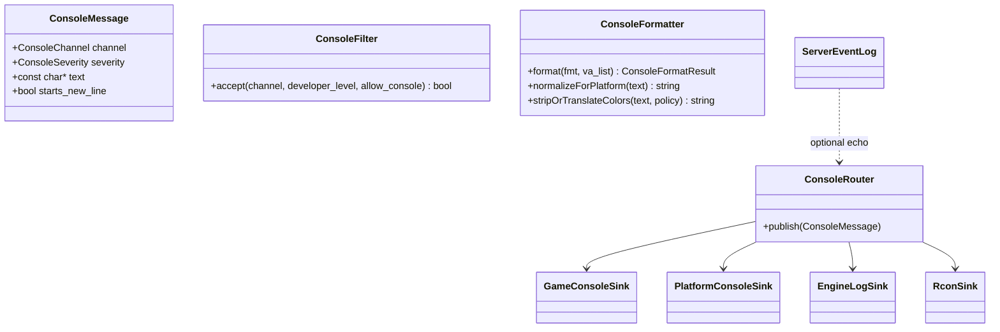

# System Console And Logging Migration Guide

## Goal

Modernize system console and logging ownership without changing the public C
print surface or confusing three separate concerns:

- message formatting and developer filtering;
- rendered in-game console UI;
- platform, log file, rcon, and server event sinks.

The first implementation step should be target-neutral and testable. The
rendered console and Win32 console window should stay in their current modules
until the output semantics are covered.

After the platform-console audit, the preferred first concrete step is the
platform/backend boundary described in `platform-console-backends.md`. That
lets Win32, POSIX, mobile log-only, and null-console behavior be described as
capabilities before `Sys_Print()` is converted into a full router.

## Recommended Shape



This is a shape to grow toward, not a mandate to land all classes at once.
Phase 43 should first extract small behavior with tests and leave the legacy
functions as adapters.

## Proposed Namespaces And Files

Start under `src/engine/console/` and `src/include/engine/console/` only when
implementation begins:

| Candidate | Responsibility |
| --- | --- |
| `xash::engine::console::ConsoleChannel` | Distinguish normal, debug, report, system, rcon, and server-event messages. |
| `xash::engine::console::SystemConsoleMessage` | First tested seam for `Con_Printf`, `Con_DPrintf`, and `Con_Reportf` visibility plus bounded-format compatibility results. |
| `xash::engine::console::ConsoleFilter` | Future broader filter for channels beyond the first system-console seam. |
| `xash::engine::console::ConsoleFormatter` | Future owner for full varargs formatting and color/control normalization. |
| `xash::engine::console::ColorPolicy` | Strip, preserve, or translate `^` color escapes and one-byte legacy prefixes. |
| `xash::engine::console::LinePrefixState` | Track line-start state for timestamp prefixes. |
| `xash::engine::console::LineEndingPolicy` | Normalize Win32 platform-console CR/LF behavior without touching the rendered console. |
| `xash::engine::console::IPlatformConsoleBackend` | Internal backend for background console output/input capabilities. |
| `xash::engine::console::ConsoleRouter` | Later fanout abstraction, once formatter/filter behavior is tested. |

Keep sink implementations thin:

- `GameConsoleSink` delegates to `Con_Print()` or whatever replaces the
  rendered console module later.
- `PlatformConsoleSink` delegates to platform code such as `Wcon_WinPrint()`
  or POSIX stdout.
- `EngineLogSink` delegates to the existing low-level file descriptor write
  path until fatal-path requirements are replaced by tests.
- `RconSink` delegates to `Rcon_Print()`.
- `ServerEventLog` should remain a separate server log service, even if it
  shares formatting helpers.

The rendered in-game console is documented separately in
`rendered-console-sink.md`. For now it remains a legacy client sink reached
through `Con_Print()` from `Sys_Print()`.

## Compatibility Surface

Do not change these signatures during the first pass:

```c
void Con_Printf( const char *fmt, ... );
void Con_DPrintf( const char *fmt, ... );
void Con_Reportf( const char *fmt, ... );
void Sys_Print( const char *msg );
void Sys_PrintLog( const char *msg );
void Log_Printf( const char *fmt, ... );
```

The wrappers should keep ownership of `va_list` handling. C++ helpers can
receive already formatted text or a small C-compatible format result structure.
That avoids making varargs behavior and exception boundaries more complicated
than they need to be.

## Debugging Utilities Integration

`xash::debugging` should remain engine-neutral. It should not include
`common.h`, read `host_developer`, call `Con_Printf`, or know about rendered
console state.

The correct integration is an engine-side adapter:

1. Debugging utilities publish to their own sinks.
2. The engine may install a sink that converts debug records into console
   messages.
3. That adapter applies engine filters and routes through the console/logging
   layer.

This keeps debugging usable in tests and tools while letting the engine decide
where messages appear.

## Filesystem Logging Integration

The filesystem should continue receiving print callbacks through
`fs_interface_t` for now. Once the engine output layer has a tested router, the
callbacks can point at that router behind the same C callback surface:

- filesystem normal output maps to normal console messages;
- filesystem debug output maps to debug messages;
- filesystem report output maps to extended report messages.

That resumes the deferred filesystem logging cleanup without making filesystem
code depend on engine globals.

## Test Plan

Add tests before changing fanout behavior:

- `SystemConsoleMessage` accepts/rejects normal, debug, and report messages for
  each developer level and `allow_console` setting. Covered by
  `tests/engine/system_console_message.cpp`.
- Bounded formatting preserves the current extra-newline-on-overflow behavior.
  Covered by `tests/engine/system_console_message.cpp`.
- The known `Con_DPrintf("0\n")` spam suppression remains documented or is
  explicitly retired later. Covered by `tests/engine/system_console_message.cpp`.
- Win32 line ending normalization is covered independently of `Wcon_WinPrint`.
- Color/control processing covers preserve, strip, and ANSI translate policies.
- `LinePrefixState` preserves current timestamp-prefix behavior across partial
  lines.

Runtime smoke is required only when output paths change. Documentation-only
audit passes do not need a smoke test.

## Suggested Phase Split

1. Document current ownership and compatibility rules.
2. Add platform console backend capability/config types and a null backend.
3. Wrap POSIX and Win32 background console behavior behind backend wrappers.
4. Route Win32 `Wcon_*` through the Win32 backend with Windows smoke coverage.
5. Route POSIX live paths in Phase 800 with POSIX validation.
6. Add target-neutral filter/format helpers and unit tests.
7. Route `Con_Printf`, `Con_DPrintf`, and `Con_Reportf` through helpers while
   preserving `Sys_Print()` fanout.
8. Extract platform/log formatting helpers from `Sys_Print()` and
   `Sys_PrintLog()` behind tests.
9. Only then consider a router/sink abstraction.

This keeps the first code change small and avoids moving the rendered console
or Win32 console window before we know exactly what behavior is contractual.
