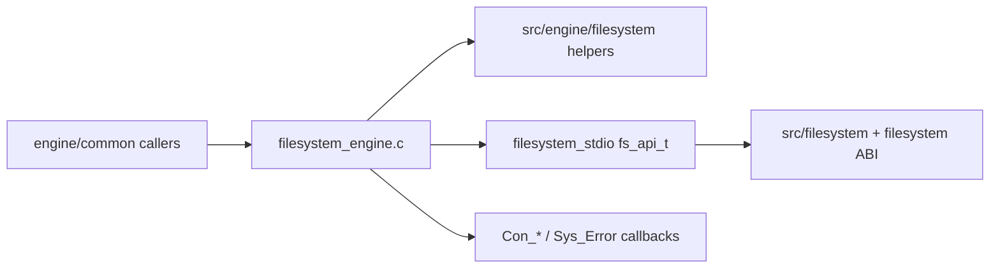

# Filesystem Bridge Migration Guide

## Goal

Modernize engine-owned filesystem bridge policy without confusing it with the
standalone filesystem module implementation.

Use these folders for engine bridge helpers:

- `src/engine/filesystem/`
- `src/include/engine/filesystem/`

Use these folders for standalone filesystem module internals:

- `src/filesystem/`
- `src/include/filesystem/`

## Boundary

The legacy engine bridge still exposes the public C engine functions declared
from `engine/common/common.h`, including `FS_Init()`, `FS_Shutdown()`,
`FS_Open()`, `FS_LoadFile()`, and `FS_SaveVFSConfig()`.

Modern helpers should sit behind that C surface until a deliberate ABI or
ownership phase changes it.



## Phase 50 Slice

`mount_flags.cpp` owns the target-neutral rule:

```text
engine cvar selections -> filesystem mount flag mask
```

`mount_flags_adapter.cpp` exposes a C function for `filesystem_engine.c`.
The adapter header also exposes the expected public filesystem bit constants
so the legacy C boundary can compile-time check drift against `FS_MOUNT_*`.

This is intentionally small. It gives tests a stable place to verify bridge
policy while avoiding changes to cvars, config files, or runtime loading.

## Logging Decision

Keep `fs_interface_t` callbacks unchanged for now:

- `_Con_Printf` maps to normal engine console output;
- `_Con_DPrintf` maps to developer output;
- `_Con_Reportf` maps to report output;
- `_Sys_Error` maps to the fatal engine path.

Do not make the filesystem module depend on `xash::debugging` or on future
console router objects directly. The eventual shape should be:

1. `filesystem_engine.c` still supplies a C-compatible callback table.
2. Callback implementations delegate to an engine-owned router.
3. The router decides which sinks receive filesystem messages.

That preserves the DLL ABI while giving the engine ownership of output policy.

## Future Candidates

- `FilesystemBridgeLogger`: C callback adapter backed by the future console
  router.
- `FilesystemRootResolver`: platform-validated resolver for root and read-only
  root directories.
- `FilesystemLibraryLoader`: host/library facade for loading `filesystem_stdio`
  and resolving `GetFSAPI`/`CreateInterface`.
- `VfsConfigSerializer`: target-neutral config text writer for `vfs.cfg`, once
  config serialization policy is separated from file IO.
