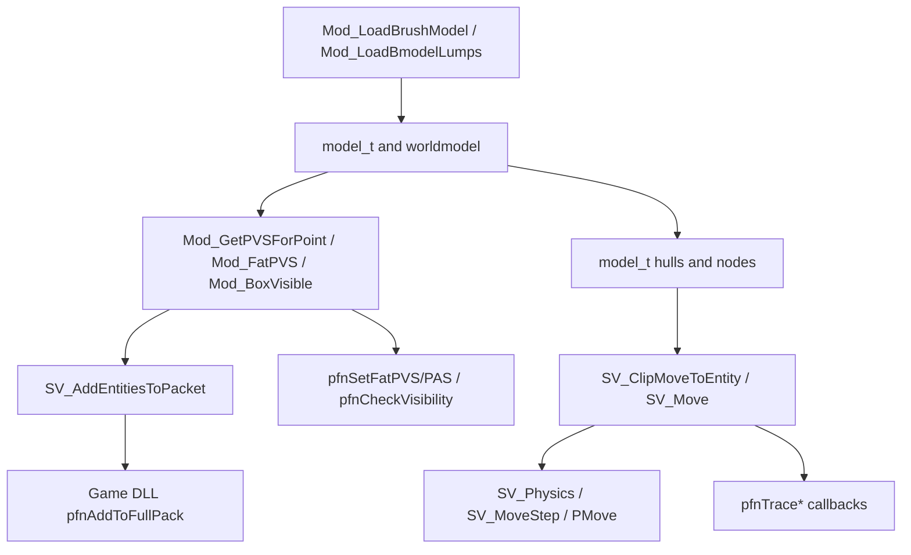

# Model And Visibility Service Boundary

Phase 113 audits the model, hull, trace, and visibility ownership around
`engine/common/mod_bmodel.c`, `engine/server/sv_world.c`,
`engine/server/sv_phys.c`, and the game-DLL-facing trace callbacks. This phase
does not route runtime behavior. The subsystem is still too stateful for that
without dedicated fixtures.

## Ownership Map

| Area | Current owner | Notes |
| --- | --- | --- |
| Model registry and lifetime | `engine/common/model.c` | Owns `mod_known`, cache lifetime, world model loading, render/userdata callbacks, and model freeing. |
| BSP load and validation | `engine/common/mod_bmodel.c` | Parses BSP, BSP30EXT, QBSP2, and BSPX lumps; fills `model_t`; detects Blue Shift swapped lumps; builds visibility and hull data. |
| Runtime PVS/PAS data | `engine/common/mod_bmodel.c` | Owns `worldmodel`, `world.visbytes`, `world.fatbytes`, `world.compressed_phs`, `world.phsofs`, `Mod_GetPVSForPoint()`, `Mod_FatPVS()`, and `Mod_BoxVisible()`. |
| Server area tree and edict links | `engine/server/sv_world.c` | Owns `sv_areanodes`, link/unlink, trigger touch traversal, touched leaf caches, and areanode clipping lists. |
| Hull selection and tracing | `engine/server/sv_world.c` with `engine/common/pm_trace.c` | Selects box, BSP, studio, or custom hulls; transforms rotated entities; calls `PM_RecursiveHullCheck()` and `PM_HullPointContents()`. |
| Physics consumption | `engine/server/sv_phys.c`, `sv_move.c`, `sv_pmove.c` | Consumes trace and hull behavior for entity physics, monster movement, player movement, impacts, and validation. |
| Game DLL trace ABI | `engine/server/sv_game.c` | Exposes `pfnTraceLine`, `pfnTraceHull`, `pfnTraceMonsterHull`, `pfnTraceModel`, `pfnTraceTexture`, `pfnSetFatPVS`, `pfnSetFatPAS`, and `pfnCheckVisibility`. |
| Frame visibility | `engine/server/sv_frame.c` | Calls game DLL `pfnSetupVisibility()` and `pfnAddToFullPack()`, handles portal-camera recursion, and enforces packet entity capacity. |

## Current Runtime Flow

## Compatibility Points

These behaviors should be treated as compatibility boundaries until fixtures
prove them:

- BSP lump parsing supports Half-Life BSP, BSP30EXT, QBSP2, BSPX, and Blue
  Shift swapped-lump detection.
- `worldmodel`, `world.*`, `g_visdata`, and decompressed PVS buffers are global
  runtime state shared by server, client, renderer, and physics extension hooks.
- `Mod_FatPVS()` returns full visibility when requested, when visdata is
  missing, when the origin leaf has no valid cluster, or when PHS data is not
  available for a PHS request.
- `Mod_GetPVSForPoint()` can return null for invalid visibility data, and
  callers depend on null meaning full visibility in several paths.
- `pfnSetFatPVS()` and `pfnSetFatPAS()` force full visibility when the world has
  no visdata, `sv_novis` is active, no origin is supplied, or client visibility
  is disabled. `SVF_MERGE_VISIBILITY` changes merge behavior.
- `pfnCheckVisibility()` returns `0`, `1`, or `2`; `2` means visibility was
  proven through the slower headnode path and a leaf cache entry may be updated.
- Classic and QBSP2 leaf storage differ. The existing Phase 105 helper only
  owns capacity policy, not BSP traversal or leaf array storage.
- Game DLL trace callbacks expose legacy hull clamping, monsterclip behavior,
  custom clipping, temporary brush-model solid/movetype changes, texture/surface
  tracing, and world-edict fallback.
- Physics extensions may override BSP hull selection and custom clipping through
  `svgame.physFuncs`.
- `SV_Move()` updates global trace fields and `svgame.globals->trace_ent`.
- Frame visibility depends on game DLL `pfnSetupVisibility()` and
  `pfnAddToFullPack()` callbacks, portal-camera recursion, and packet entity
  capacity.

## Snapshot Seams

The useful future seam is not "move `SV_Move()` into C++" in one pass. The
safer shape is adapter-provided snapshots around smaller decisions:

| Snapshot seam | Possible contents | Usefulness |
| --- | --- | --- |
| Visibility request snapshot | origin present, world has visdata, `sv_novis`, client visibility disabled, merge flag, request type PVS/PAS, single-player fullvis | Can model `pfnSetFatPVS/PAS` admission without owning BSP bits. |
| Trace request snapshot | start/end, mins/maxs, requested hull, no-monsters mode, monsterclip request, ignore-transparent flag | Can model callback normalization and route choice. |
| Trace target snapshot | model type, solid type, movetype, flags, owner relation, group relation, bounds, angles, custom clipping available | Can model `SV_ClipToEntity()` admission before exact hull tracing. |
| Visibility entity snapshot | valid edict, custom entity owner, headnode, cached leaf count, cached leaf values, large-leaf mode | Can model `pfnCheckVisibility()` decisions around cached leafs versus headnode traversal. |
| Model metadata snapshot | type, bounds, radius, hull mins/maxs, flags such as `MODEL_QBSP2` and `MODEL_HAS_ORIGIN` | Useful for fixture tests and route planning, but should not replace `model_t` yet. |

These snapshots should avoid `model_t`, `edict_t`, `mnode_t`, `mleaf_t`,
`hull_t`, and `sv_client_t` in their public modern interfaces. Legacy adapters
can collect those live facts.

## Fixture Feasibility

| Behavior | Fixture feasibility now | Recommendation |
| --- | --- | --- |
| Hull-number clamping and game-DLL callback route choices | Already covered by Phase 98 pure policy tests. | Keep and extend only when new decisions are added. |
| Entity leaf capacity and cached headnode index cycling | Already covered by Phase 105 tests. | Keep as capacity policy, not BSP traversal. |
| PVS/PAS fullvis and merge decision inputs | Easy to cover with pure snapshot tests. | Good next helper if we need another small phase. |
| `Mod_PointInLeaf()` and `Mod_BoxVisible()` | Possible with synthetic in-memory nodes/leafs, but requires carefully shaped `model_t` fixtures. | Add only after a dedicated low-level model fixture phase. |
| PVS decompression and PHS construction | Possible, but should use explicit golden byte fixtures. | Defer until generated fixture data exists. |
| `SV_ClipMoveToEntity()` and `SV_Move()` | High-risk. Needs worldmodel, edicts, area tree, physics extension callbacks, and trace globals. | Do not route until a trace fixture harness exists. |
| BSP lump loading | High-risk binary compatibility work. | Defer until a minimal generated BSP fixture or fixture corpus policy exists. |

## Recommended Boundary

Do not create a broad model/visibility service implementation yet.

The next safe steps are:

1. Keep `mod_bmodel.c`, `model.c`, `sv_world.c`, `sv_phys.c`, and frame
   visibility as legacy owners.
2. Add small snapshot helpers only for pure request decisions, such as
   PVS/PAS fullvis/merge planning or trace callback normalization.
3. Create a dedicated fixture plan before routing `Mod_PointInLeaf()`,
   `Mod_BoxVisible()`, `SV_ClipMoveToEntity()`, `SV_Move()`, or BSP lump
   loading.
4. Preserve existing Phase 98 and Phase 105 helpers as enablers, not as
   evidence that the full world/trace subsystem is ready to move.

This keeps the rewrite moving without turning the model/visibility lane into a
blind port of the hardest live engine state.
