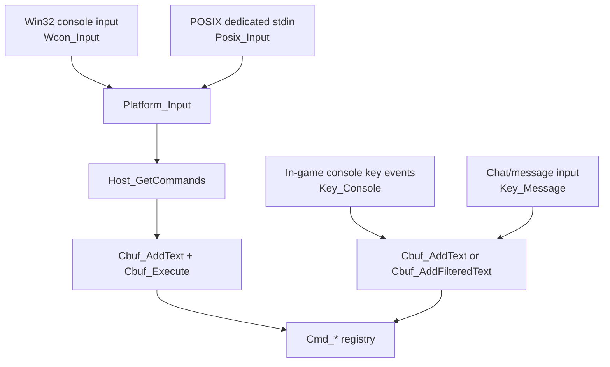
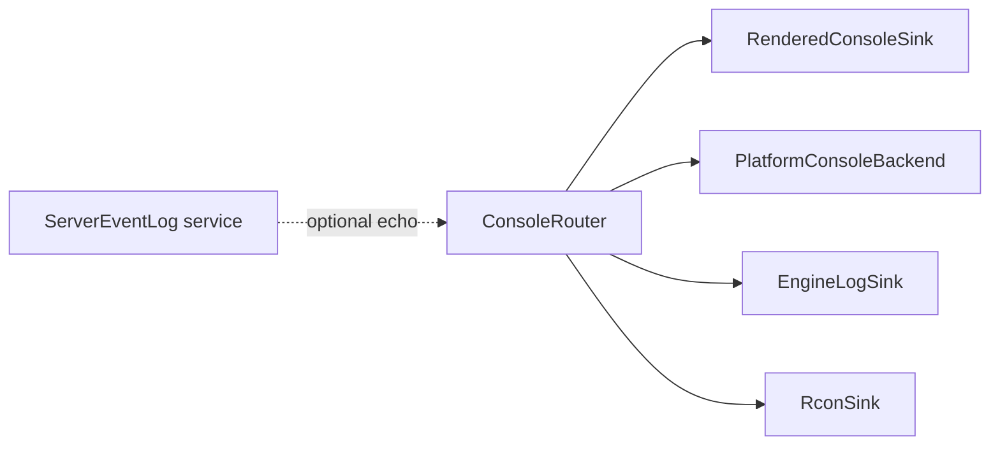

# Platform Console Backends

## Purpose

This document narrows Phase 43 toward platform console backends before a broad
console hub/router exists. The goal is to make the platform-facing background
console behavior explicit and portable while leaving the rendered in-game
console in `engine/client/console.c` for now.

The backend should model capabilities, not platforms as assumptions. Windows
has an attached or allocated console window with input editing. POSIX generally
has stdout plus dedicated stdin input. Android and other mobile/console
platforms may only have a log sink or no background command input at all.

## Current Command And Input Hierarchy



Important consequences:

- Background console input is platform-owned and host-polled.
- In-game console input is client UI-owned and key-event driven.
- Both ultimately feed the same command buffer and command registry.
- The platform console backend must not become the in-game console backend.
- The rendered console can later become a sink in a higher-level router, but it
  should not block platform backend extraction.

## Current Platform Matrix

| Platform family | Current output behavior | Current input behavior | Backend capability |
| --- | --- | --- | --- |
| Win32 | `Sys_Print()` calls `Wcon_WinPrint()` after line/control normalization. | `Platform_Input()` calls `Wcon_Input()`. Dedicated console has line editing, history, tab completion, and status line. | Output, input, show/hide, input disable, status line, command registration. |
| POSIX/Linux/BSD/macOS desktop | `Sys_PrintStdout()` writes to stdout with optional ANSI color translation. | `Platform_Input()` calls `Posix_Input()` for dedicated, non-mobile, non-low-memory builds. | Output through stdout, input through stdin, no GUI console window. |
| Android | `Sys_PrintStdout()` strips color and calls Android log when available. | No background command input in the current platform facade. | Output-only log sink. |
| iOS | `Sys_PrintStdout()` strips color and calls `IOS_Log()`. | No background command input in the current platform facade. | Output-only log sink. |
| Switch/Vita | Debug stderr paths exist for selected builds; Vita gates stderr output on developer mode. | No generic background console input in the current platform facade. | Optional output-only debug sink. |
| Dedicated stubs | No rendered console. | Platform input feeds commands when available. | Platform backend is the only interactive console. |

## Proposed Backend Contract

Keep the first contract smaller than a full logging router. It should describe
only background/platform console behavior:

```cpp
namespace xash::engine::console {

enum class PlatformConsoleCapability : unsigned {
    Output = 1 << 0,
    Input = 1 << 1,
    Visibility = 1 << 2,
    StatusLine = 1 << 3,
    CommandRegistration = 1 << 4,
};

struct PlatformConsoleConfig {
    bool dedicated = false;
    bool show_always = false;
    int developer_level = 0;
};

class IPlatformConsoleBackend {
public:
    virtual ~IPlatformConsoleBackend() = default;

    virtual unsigned capabilities() const = 0;
    virtual void initialize(const PlatformConsoleConfig& config) = 0;
    virtual void shutdown() = 0;
    virtual void print(const char* text) = 0;
    virtual const char* readCommand() = 0;
    virtual void show(bool visible) = 0;
    virtual void disableInput() = 0;
    virtual void setStatus(const char* text) = 0;
    virtual void registerCommands() = 0;
};

}
```

This interface should remain internal. Existing C functions such as
`Wcon_CreateConsole`, `Wcon_WinPrint`, `Wcon_Input`, `Platform_Input`, and
`Platform_SetStatus` can delegate into it later. That keeps legacy call sites
stable while giving the platform implementation a cleaner internal shape.

Initial implementation landed in:

- `src/include/engine/console/platform_console_backend.hpp`
- `src/engine/console/platform_console_backend.cpp`
- `tests/engine/platform_console_backend.cpp`

The implemented slice includes capability helpers, default config values,
`IPlatformConsoleBackend`, `NullPlatformConsoleBackend`,
`PosixPlatformConsoleBackend`, and `Win32PlatformConsoleBackend` wrappers with
injectable I/O.

The Win32 live route now keeps the public C surface in
`engine/platform/win32/con_win.c`, but those `Wcon_*` functions delegate through
`src/engine/console/platform_console_backend_adapter.cpp` before calling the
legacy implementation. This proves the backend boundary without changing the
external platform ABI or rewriting the Win32 console editor in the same step.

## Backend Types

Recommended initial backend classes:

| Backend | Initial home | Notes |
| --- | --- | --- |
| `Win32PlatformConsoleBackend` | `src/engine/console/platform/win32_*` or `src/engine/platform/console/win32_*` | Wraps attached/allocated console lifecycle, print, input editing, command history, status line, show/hide, and input disable. |
| `PosixPlatformConsoleBackend` | `src/engine/console/platform/posix_*` or `src/engine/platform/console/posix_*` | Wraps stdout output policy and dedicated stdin polling. Linux can use this unless it gains Linux-specific behavior. |
| `NullPlatformConsoleBackend` | target-neutral | Safe default for platforms with no background console. `print()` is a no-op or forwards to a separate platform log sink by policy. |
| `MobileLogConsoleBackend` | platform-selected | Output-only wrapper for Android/iOS style logging, if we decide to separate mobile log output from stdout formatting. |

For source layout, prefer `src/engine/console/platform/` while the work is
owned by console/logging. If Phase 44 later extracts a broader platform facade,
these files can move under a platform service directory without changing the
interface.

## Sink Boundaries

Platform console backends are not the whole output system:

- The rendered in-game console remains a separate client sink.
- `engine.log` remains a low-level file sink owned by the engine log lifecycle.
- Server event logs remain server-owned.
- Rcon remains an output redirect sink.
- The platform console backend handles only background console window/stdout
  style output and background command input.

That means the eventual hub can fan out to:



## Implementation Order

1. Add target-neutral backend capability/config types with unit tests.
2. Add a `NullPlatformConsoleBackend` test double.
3. Add a POSIX-style backend with injectable I/O and tests for dedicated-only
   command polling.
4. Add a Win32-style backend with injectable I/O and tests for `Wcon_*`
   lifecycle/capability behavior.
5. Route `Platform_Input()` through the selected backend without changing host
   polling behavior.
6. Wrap POSIX stdin/stdout behavior behind the POSIX backend in a POSIX
   validation build.
7. Route Win32 `Wcon_*` behavior through the Win32 backend while preserving the
   C functions as adapters. Completed for the current Windows smoke path.
8. Only after platform backends are stable, revisit `Sys_Print()` fanout and the
   higher-level console router.

## Compatibility Notes

- Preserve Win32 allocation rules: normal non-dedicated developer level `0`
  does not need an allocated console; dedicated and verbose developer runs can
  allocate or show one.
- Preserve Win32 attached-console restoration behavior on shutdown.
- Preserve dedicated-only background command input semantics.
- Preserve Win32 tab completion through the existing command completion layer.
- Preserve POSIX daemonize behavior, where stdin/stdout/stderr may already be
  redirected to `/dev/null`.
- Treat Android/iOS output as log sinks, not interactive consoles.
- Avoid exceptions across the C adapter boundary.
