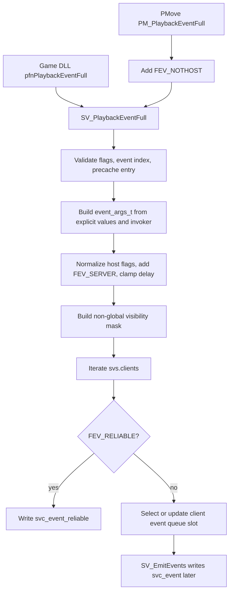

# Server Event Playback Boundary

Phase 110 audits server-side event playback before adding another route-through
helper. This path is small in surface area, but it touches game DLL ABI,
per-client visibility, prediction flags, queued events, and network message
serialization. The first modern pass should therefore isolate decisions, not
move ownership of the whole event system.

## Legacy Entry Points

The live playback owner is `SV_PlaybackEventFull()` in `engine/server/sv_game.c`.
It is reached through two compatibility surfaces:

| Entry point | Source | Compatibility behavior |
| --- | --- | --- |
| Game DLL engine function | `enginefuncs_t::pfnPlaybackEventFull` | Exposes the historical server event playback callback to game DLLs. |
| Player movement callback | `svgame.pmove->PM_PlaybackEventFull` in `sv_pmove.c` | Validates the PMove player edict and always adds `FEV_NOTHOST`, matching GoldSrc behavior. |

Reliable events are written immediately through `SV_PlaybackReliableEvent()`.
Unreliable events are stored in each recipient client's `sv_client_t::events`
queue and are emitted later by `SV_EmitEvents()` in `engine/server/sv_frame.c`.

## Current Flow

## Compatibility Rules To Preserve

- `FEV_CLIENT` events are ignored by the server playback path.
- Invalid event indexes and unprecached event names are rejected with the
  existing console diagnostics.
- Explicit non-zero origin and angle inputs set `FEVENT_ORIGIN` and
  `FEVENT_ANGLES` in `event_args_t`.
- If the invoker is valid, missing explicit origin and angles fall back to the
  invoker entity values. The invoker also supplies `entindex`, ducking state,
  and the visibility point.
- Non-global events without a visibility point are ignored after printing the
  legacy missing-origin diagnostic.
- `FEV_NOTHOST` and `FEV_HOSTONLY` are only meaningful for client invokers.
  When the invoker is not a client, the server prints the historical warnings
  and clears those bits.
- `FEV_SERVER` is always set before delivery.
- Negative delays are clamped to zero.
- Non-global events use the legacy fat visibility mask before per-client
  recipient checks.
- Recipients must be spawned, have an edict, not be `FCL_FAKECLIENT`, pass the
  group-filter policy, and pass the legacy visibility check.
- `FEV_NOTHOST` only suppresses the current client or invoker when that client
  uses local weapons. This preserves the GoldSrc/Xash compatibility note in the
  legacy source.
- `FEV_HOSTONLY` sends only to the invoker client.
- `FEV_RELIABLE` bypasses the event queue and writes directly to the reliable
  netchan message.
- `FEV_UPDATE` searches for an existing queued event with the same event index
  and invoker entity index. If no matching slot exists, playback uses the first
  empty slot. If no slot exists, that recipient silently drops the unreliable
  event.
- `SV_EmitEvents()` limits transmitted queued events to
  `MAX_EVENT_QUEUE / 2 - 1`, maps queued events to packet entity indexes where
  possible, clears transient origin/angle/velocity fields when packet state can
  supply them, then clears the queue slots after attempting emission.

## Snapshot Candidates

These pieces can become target-neutral helpers once the legacy caller adapts
live data into plain values:

| Candidate | Proposed modern role |
| --- | --- |
| Event flag admission | Decide whether a server playback request should be ignored because of `FEV_CLIENT`. |
| Event flag normalization | Add `FEV_SERVER`, clamp negative delay, and clear host-only/not-host bits when there is no client invoker. |
| Argument construction policy | Build a neutral event-argument snapshot from explicit caller values plus an optional invoker snapshot. |
| Recipient admission | Combine spawned/edict/fake-client, group-pass, visibility-pass, host-only, not-host, local-weapons, current-client, and invoker-match facts into one named decision. |
| Queue slot selection | Choose an existing update slot or the first empty slot from a neutral queue-slot snapshot. |
| Emission count clamp | Preserve the `MAX_EVENT_QUEUE / 2 - 1` transmit cap as a small named rule. |

The Phase 111 helper should start with recipient admission and queue-slot
selection. Those are behavior-heavy, easy to test, and already have enablers
from Phase 107 group filtering and Phase 109 client flag predicates.

## Legacy-Owned State

These pieces should stay in legacy code until narrower phases make them safe:

- the exported game DLL ABI and `enginefuncs_t` table;
- PMove callback wiring and `svgame.pmove` ownership;
- event precache storage and `SV_EventIndex()`;
- `edict_t` validity checks, `NUM_FOR_EDICT()`, and `SV_ClientFromEdict()`;
- live `sv`, `svs`, and `sv_client_t` iteration;
- visibility mask generation through `Mod_FatPVS()` and filtering through
  `SV_CheckClientVisiblity()`;
- actual queue mutation in `sv_client_t::events`;
- reliable and unreliable wire serialization through `MSG_*` and
  `MSG_WriteDeltaEvent()`;
- console diagnostic text and severity routing.

## Test Targets For Phase 111

The next phase should add focused tests for pure policy decisions before any
route-through:

- server admission ignores `FEV_CLIENT`;
- normalized flags add `FEV_SERVER`, clamp negative delay, and clear
  `FEV_NOTHOST` / `FEV_HOSTONLY` for non-client invokers;
- recipient admission rejects unspawned clients, missing edicts, fake clients,
  failed group filters, and failed visibility;
- no direct HLTV/spectator filter exists in this path unless the client is also
  represented by one of the routed predicate inputs;
- `FEV_NOTHOST` only suppresses current/invoker recipients when local weapons
  are active;
- `FEV_HOSTONLY` admits only the invoker recipient;
- reliable delivery is selected without queue-slot lookup;
- `FEV_UPDATE` reuses a matching event/invoker slot and otherwise falls back to
  the first empty slot;
- a full unreliable queue reports no slot, preserving the current silent drop.

## Recommended Boundary

Create a small `server_event_playback_policy` helper under
`src/engine/server` with no dependency on `edict_t`, `sv_client_t`,
`sizebuf_t`, or `MSG_*`.

The adapter in `engine/server` should collect live facts from the legacy
structures, call the policy helper, and then keep the side effects in the old
owner. That keeps event playback compatible while turning the most fragile
branching logic into named, tested C++ concepts.
