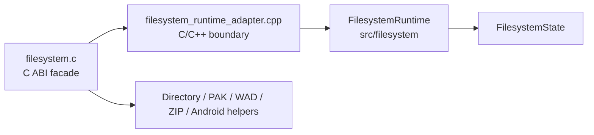

# Filesystem Runtime Ownership

Phase 25 introduces `FilesystemRuntime` as the modern owner for filesystem
runtime state and the first shared ownership operations. This is intentionally
incremental: legacy C facades still expose `fs_api_t`, `searchpath_t`, and
`file_t`, but mutation flows through a runtime boundary before the future
facade-thinning phase.

## Ownership Boundary

`FilesystemRuntime` now owns:

- copied root/base/game/rodir/language/direct-path state through
  `FilesystemState`
- current search path head and write path references
- dynamic search path clearing policy through callback-based list operations
- prepend ownership for newly mounted search paths
- core `file_t` allocation/free routing through callback-based memory helpers
- rescan planning for mount flag masking, direct-path reset, and localization
  language selection

The legacy facade still owns:

- the concrete `searchpath_t` layout and public callback table
- concrete `file_t` fields and OS descriptor behavior
- gameinfo parsing, `FI.games`, and recursive hierarchy decisions
- backend mount entry points such as `FS_AddPak_Fullpath`
- public ABI tables and exported interfaces

## Why Callback-Based Operations

The modern runtime must not include `filesystem_internal.h` or depend on the
concrete legacy structures. For this phase, it receives small callback tables
for operations that require legacy layout knowledge:

- `SearchPathListOps`: read/set next pointer, identify static paths, close,
  free, and mark game entries unmounted
- `FileHandleMemoryOps`: allocate and free `file_t`

This keeps the ownership decision in modern code while avoiding a direct
dependency on private C layout details.

## Search Path Ownership

`FS_AddArchive_Fullpath` now prepends mounted search paths through
`FS_FilesystemRuntime_PrependSearchPath`. `FS_ClearSearchPath` now asks the
runtime to remove dynamic paths, preserve static paths, clear stale write-path
references, and report the resulting head/write path.

The legacy `fs_searchpaths` and `fs_writepath` globals remain as mirrors for
existing code and exported global variables. They should disappear only after
facade convergence removes direct global access.

## File Handle Ownership

`FS_SysOpen`, `FS_OpenHandle`, and `FS_Close` now route the core `file_t`
allocation/free path through runtime helpers. This does not yet replace packed
file internals or Android adapter allocation, but it gives future file-handle
work one runtime-owned entry point.

## Rescan Ownership

`FilesystemRuntime::beginRescan` currently owns target-neutral rescan planning:

- masks mount flags to the supported runtime mount set
- disables direct paths for rescans
- chooses whether the localization language should be retained

Gameinfo parsing and hierarchy recursion remain in `filesystem.c` for now
because they still depend on `FI`, `gameinfo_t`, file IO, and legacy mount
entry points. The next reasonable extraction is a runtime-facing gameinfo
service that consumes parsed records instead of mutating `FI.games` directly.

## Remaining Simplification Opportunities

- Move `FS_SetSearchPaths`, `FS_SetWritePath`, and related mirror globals fully
  into runtime adapter calls.
- Move file-handle allocation in backend-specific adapters to the runtime file
  memory helper.
- Represent mounted search paths as runtime-owned records, with `searchpath_t`
  becoming only the compatibility view.
- Move gameinfo list ownership out of `FI.games` once parsing is split from
  mount request generation.
