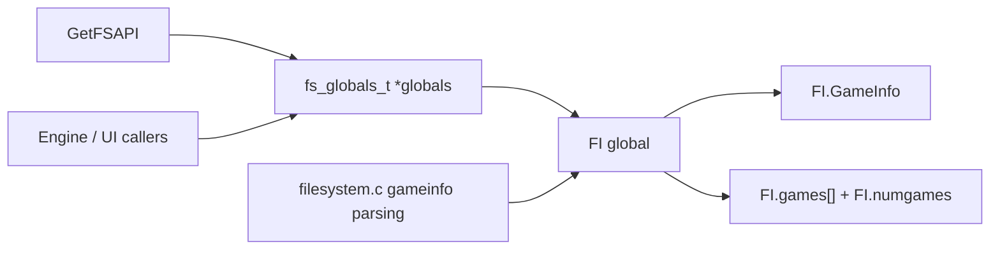
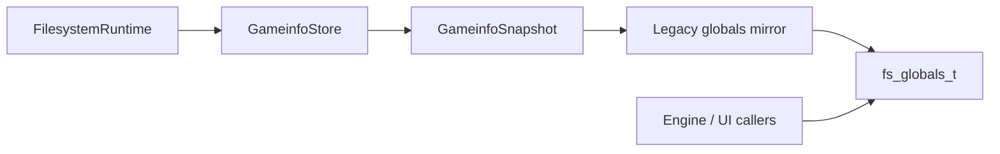

# Gameinfo Snapshot Plan

## Purpose

`FI.GameInfo`, `FI.games`, and `FI.numgames` are still public-facing state
returned through `GetFSAPI`. Engine UI, game switching, and compatibility code
can read those structures directly, so the modern runtime should not move or
replace them in one step.

The safer migration is to let modern code own a snapshot/query model first,
then mirror that model back into the legacy `fs_globals_t` view until external
callers stop depending on direct struct access.

## Current Legacy Shape

The important compatibility rule is that `fs_globals_t` remains a stable view
of the active game and discovered game list.

## Target Shape

## Proposed Types

- `GameinfoRecord`
  A modern value object containing a normalized copy of one `gameinfo_t`.

- `GameinfoSnapshot`
  Immutable view of the current game, discovered games, source path, mtime, and
  rodir/source metadata.

- `GameinfoStore`
  Mutable owner used while scanning, parsing, adding, removing, and selecting
  gameinfo records.

- `LegacyGameinfoMirror`
  Adapter that refreshes `FI.GameInfo`, `FI.games`, and `FI.numgames` from a
  snapshot without changing the public `fs_globals_t` ABI.

## Migration Order

1. Add tests describing current `FI.games` ordering, active game selection,
   rodir visibility, duplicate gamefolder behavior, and shutdown cleanup.
2. Add `GameinfoRecord` helpers for copying and comparing existing
   `gameinfo_t` values.
3. Add `GameinfoSnapshot` as a read-only query object over existing data.
4. Add `LegacyGameinfoMirror` that writes the snapshot back to `FI`.
5. Move parsing and discovery into `GameinfoStore` once tests prove the mirror
   preserves the old view.
6. Only after engine callers move to query functions, consider shrinking the
   public mirror.

## Compatibility Rules

- Do not change `fs_globals_t`, `gameinfo_t`, or `GetFSAPI` signatures during
  this phase.
- Keep string buffer sizes and HL25 compatibility fields intact.
- Preserve the lifetime expectation that `FI.GameInfo` and `FI.games[]` remain
  valid until shutdown or a documented refresh point.
- Keep parsed game ordering stable unless a test and migration note explicitly
  documents a behavior change.
- Treat rodir entries as first-class records; do not collapse them into normal
  writable game directories.

## Test Requirements

- Active game points at the selected game after `InitStdio`.
- Discovered game list remains stable across repeated scans.
- Shutdown clears or releases all mirrored records without dangling pointers.
- Rodir gameinfo records keep their `rodir` marker and mtime.
- Duplicate game folders preserve the current winner/visibility behavior.

