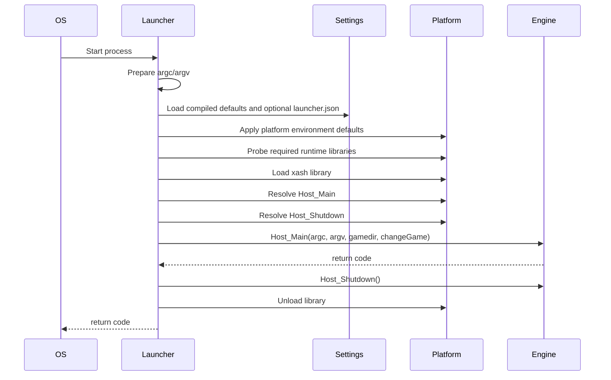
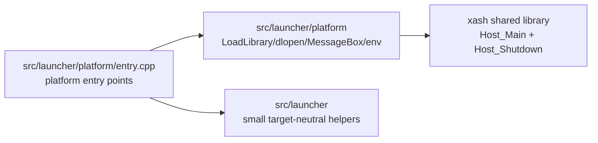

# Game Launch Architecture

## Current Responsibilities

`src/launcher/platform/entry.cpp` is the native executable wrapper used when the
engine is built as a shared library. It owns:

- Windows `WinMain` argument conversion.
- POSIX `main` argument forwarding.
- Windows high-performance GPU selection exports.
- User-visible fatal launch errors.
- The change-game callback marker passed to the engine.

Platform support code under `src/launcher/platform/` owns:

- Sailfish-specific environment defaults.
- SDL2 dependency probing on Windows.
- Engine library loading and unloading.
- `Host_Main` and `Host_Shutdown` export lookup.

## Platform Branches

| Area | Windows | POSIX |
| --- | --- | --- |
| Entry point | `WinMain` converts `GetCommandLineW()` through `CommandLineToArgvW`. | `main` forwards `argc` and `argv` directly. |
| Engine library | Loads `xash.dll` with `LoadLibraryW`. | Loads `libxash.so` or platform extension with `dlopen`. |
| SDL2 preflight | Probes `SDL2.dll` with `LoadLibraryExW(..., LOAD_LIBRARY_AS_DATAFILE)`. | No launcher-side SDL2 probe. |
| Export lookup | Uses `GetProcAddress`. | Uses `dlsym`. |
| Fatal launch errors | Shows `MessageBoxA` titled `Xash Error`. | Prints to `stderr`. |
| GPU preference | Exports NVIDIA and AMD high-performance GPU hints. | Not applicable. |
| Environment setup | No launcher-specific default environment. | Sailfish sets `XASH3D_BASEDIR` and `XASH3D_RODIR`. |

## Current Launch Sequence

## Target Shape

The migration keeps process entry signatures and fatal error presentation in
`src/launcher/platform/entry.cpp`. Modern helpers own reusable decisions such
as library labels, launch settings, status records, and testable argument/path
transformations.

## First Extracted Helper

`src/launcher/launch_settings.cpp` owns compiled target-neutral defaults.
`src/launcher/config.cpp` owns optional runtime overrides:

- engine library labels, with runtime override support;
- SDL2 dependency probe labels, with runtime override support;
- required and optional engine export names;
- build-default game directory fallback and propagation;
- menu change-game enable/disable calculation from build configuration or JSON.

The launcher entry shell still performs process-level calls directly in
`src/launcher/platform/entry.cpp`.

`src/launcher/engine_library.cpp` owns the target-neutral dynamic library
sequence, while Waf selects the platform library implementation:

- `src/launcher/platform/library_win32.cpp`;
- `src/launcher/platform/library_posix.cpp`.

Those files own:

- SDL2 preflight on Windows;
- engine DLL/SO loading;
- `Host_Main` and `Host_Shutdown` export lookup;
- optional shutdown export handling;
- engine library unload.

`src/launcher/platform/entry.cpp` still owns process entry points and fatal error
presentation. This follows the common engine pattern seen in projects such as
Godot: platform entry points stay thin and delegate into shared startup code
instead of hiding every platform call behind a large generic interface.

`src/launcher/application.cpp` owns the shared launch sequence: load settings,
apply platform environment defaults, load the engine, run `Host_Main`, and
unload.
`src/launcher/platform/entry.cpp` calls this runner from POSIX `main` and Windows
`WinMain`.

On Windows, `src/launcher/platform/win32_argv.cpp` owns the `CommandLineToArgvW`
capture and allocation cleanup. This keeps `WinMain` focused on entry-point
plumbing and error presentation.

## Runtime Configuration

The launcher supports an optional flat JSON config named `launcher.json`.
Lookup order is:

1. `XASH3D_LAUNCHER_CONFIG`, when set.
2. `launcher.json` next to `argv[0]`, when `argv[0]` includes a directory.
3. `launcher.json` in the current working directory.

If no file is present, inaccessible, or invalid, the launcher keeps compiled
defaults. This preserves current behavior on platforms where a loose config
file is unavailable.

Supported fields:

- `defaultGameDir` or `default_game_dir`.
- `allowMenuChangeGame` or `allow_menu_change_game`.
- `disableMenuChangeGame` or `disable_menu_change_game`.
- `engineLibrary` or `engine_library`.
- `sdl2Library` or `sdl2_library`.
- `probeSdl2` or `probe_sdl2`.

`resources/launcher/launcher.example.json` documents the expected shape.

## Resource Boundary

The top-level `resources/launcher/` tree owns Windows resource/build assets:

- `resources/launcher/windows/game.rc`
- `resources/launcher/windows/icon-xash-material.ico`
- `resources/launcher/source/icon-xash-material.png`

These are platform packaging inputs rather than launcher behavior. Keeping them
under top-level `resources/` avoids mixing product assets into either
`src/launcher` implementation code or platform-neutral launcher helpers.

## Executable Target Boundary

`src/wscript` owns the launcher executable target. It wires
`src/launcher/platform/entry.cpp`, links `modern_launcher`, selects platform
implementation files, and attaches platform resources. The old `game_launch/`
subproject has been removed so launcher implementation and executable build
ownership now live in one source tree.

The intended resource layout is documented in
`Documentation/codex/modern/game-launch/layout-policy.md`.

## Further Extraction Candidates

- `SailfishEnvironmentPlan`: environment values before calling `setenv`, if
  Sailfish needs more than the current selected platform implementation.

## Test Strategy

- Unit-test target-neutral helpers in `tests/launcher/`.
- Unit-test safe launcher bridge states, such as unloaded engine library
  behavior, without loading a real DLL/SO.
- Keep dynamic library loading and message box behavior under manual smoke
  tests until a fake loader boundary exists.
- Keep runtime launch validation in `Documentation/codex/windows-build-run-notes.md`
  because it depends on local SDL2 and Half-Life assets.

## Known Compatibility Risks

- Windows argument conversion currently owns manual allocation and cleanup.
  Any future RAII cleanup must preserve the current `argv` shape passed to
  `Host_Main`.
- Build-configured defaults such as `XASH_GAMEDIR` and
  `XASH_DISABLE_MENU_CHANGEGAME` now provide fallback values. Runtime JSON
  overrides must never make startup dependent on the config file existing.
- `Host_Shutdown` is optional, but must be called when present.
- The presence or absence of the change-game callback changes engine behavior,
  so the `XASH_DISABLE_MENU_CHANGEGAME` flag must remain covered.

## Non-Goals For The First Pass

- Replacing `WinMain` or POSIX `main`.
- Abstracting every dynamic-library API behind a large interface.
- Changing message box or stderr behavior.
- Changing engine startup or shutdown order.
- Moving engine ownership into the launcher.
