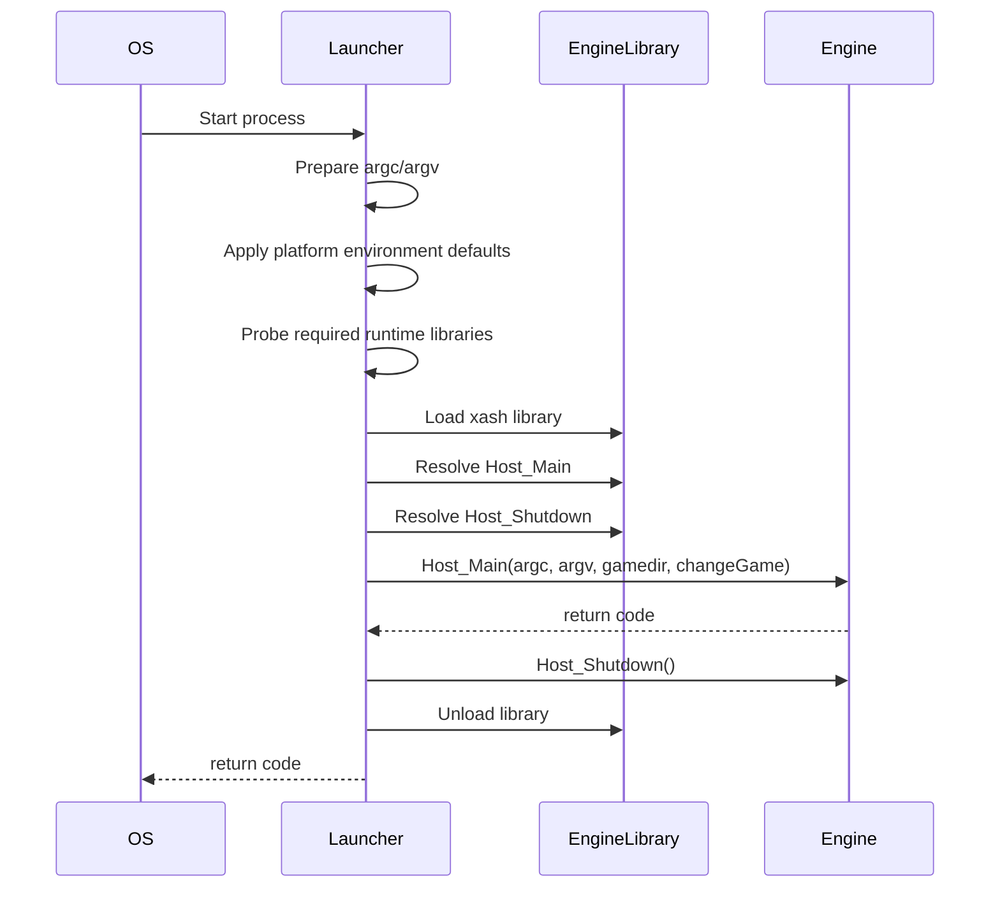
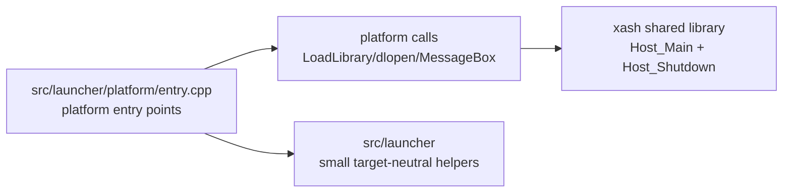

# Game Launch Architecture

## Current Responsibilities

`src/launcher/platform/entry.cpp` is the native executable wrapper used when the
engine is built as a shared library. It owns:

- Windows `WinMain` argument conversion.
- POSIX `main` argument forwarding.
- Windows high-performance GPU selection exports.
- Sailfish-specific environment defaults.
- SDL2 dependency probing on Windows.
- Engine library loading and unloading.
- `Host_Main` and `Host_Shutdown` export lookup.
- User-visible fatal launch errors.
- The change-game callback marker passed to the engine.

## Platform Branches

| Area | Windows | POSIX |
| --- | --- | --- |
| Entry point | `WinMain` converts `GetCommandLineW()` through `CommandLineToArgvW`. | `main` forwards `argc` and `argv` directly. |
| Engine library | Loads `xash.dll` with `LoadLibraryW`. | Loads `libxash.so` or platform extension with `dlopen`. |
| SDL2 preflight | Probes `SDL2.dll` with `LoadLibraryExW(..., LOAD_LIBRARY_AS_DATAFILE)`. | No launcher-side SDL2 probe. |
| Export lookup | Uses `GetProcAddress`. | Uses `dlsym`. |
| Fatal launch errors | Shows `MessageBoxA` titled `Xash Error`. | Prints to `stderr`. |
| GPU preference | Exports NVIDIA and AMD high-performance GPU hints. | Not applicable. |
| Environment setup | No launcher-specific default environment. | Sailfish sets `XASH3D_BASEDIR` and `XASH3D_RODIR`. |

## Current Launch Sequence

## Target Shape

The migration keeps process entry signatures and fatal error presentation in
`src/launcher/platform/entry.cpp`. Modern helpers own reusable decisions such
as library labels, launch settings, status records, and testable argument/path
transformations.

## First Extracted Helper

`src/launcher/launch_settings.cpp` now owns the first target-neutral launcher
metadata:

- engine library labels;
- SDL2 dependency probe labels;
- required and optional engine export names;
- build-default game directory fallback and propagation;
- menu change-game enable/disable calculation from build configuration.

The launcher entry shell still performs process-level calls directly in
`src/launcher/platform/entry.cpp`.

`src/launcher/engine_library.cpp` owns the next platform bridge:

- SDL2 preflight on Windows;
- engine DLL/SO loading;
- `Host_Main` and `Host_Shutdown` export lookup;
- optional shutdown export handling;
- engine library unload.

`src/launcher/platform/entry.cpp` still owns process entry points and fatal error
presentation. This follows the common engine pattern seen in projects such as
Godot: platform entry points stay thin and delegate into shared startup code
instead of hiding every platform call behind a large generic interface.

`src/launcher/application.cpp` now owns the shared launch sequence: apply
platform environment defaults, load the engine, run `Host_Main`, and unload.
`src/launcher/platform/entry.cpp` calls this runner from POSIX `main` and Windows
`WinMain`.

On Windows, `src/launcher/win32_argv.cpp` owns the `CommandLineToArgvW`
capture and allocation cleanup. This keeps `WinMain` focused on entry-point
plumbing and error presentation.

## Resource Boundary

The top-level `resources/launcher/` tree owns Windows resource/build assets:

- `resources/launcher/windows/game.rc`
- `resources/launcher/windows/icon-xash-material.ico`
- `resources/launcher/source/icon-xash-material.png`

These are platform packaging inputs rather than launcher behavior. Keeping them
under top-level `resources/` avoids mixing product assets into either
`src/launcher` implementation code or the thin `game_launch` executable target
wrapper.

## Executable Target Boundary

`game_launch/wscript` remains the executable target wrapper. It wires
`src/launcher/platform/entry.cpp`, links `modern_launcher`, and attaches
platform resources. This lets the source tree move toward `src/` without
forcing a larger Waf project layout change in the same phase.

The intended resource layout is documented in
`Documentation/codex/modern/game-launch/layout-policy.md`.

## Further Extraction Candidates

- `DependencyPlan`: required runtime dependency labels before OS-specific load
  calls.
- `SailfishEnvironmentPlan`: environment values before calling `setenv`.

## Test Strategy

- Unit-test target-neutral helpers in `tests/launcher/`.
- Unit-test safe launcher bridge states, such as unloaded engine library
  behavior, without loading a real DLL/SO.
- Keep dynamic library loading and message box behavior under manual smoke
  tests until a fake loader boundary exists.
- Keep runtime launch validation in `Documentation/codex/windows-build-run-notes.md`
  because it depends on local SDL2 and Half-Life assets.

## Known Compatibility Risks

- Windows argument conversion currently owns manual allocation and cleanup.
  Any future RAII cleanup must preserve the current `argv` shape passed to
  `Host_Main`.
- Build-configured defaults such as `XASH_GAMEDIR` and
  `XASH_DISABLE_MENU_CHANGEGAME` now enter the launcher through
  `GetDefaultLaunchSettings()`. Keep that helper covered when adding new
  launcher defaults.
- `Host_Shutdown` is optional, but must be called when present.
- The presence or absence of the change-game callback changes engine behavior,
  so the `XASH_DISABLE_MENU_CHANGEGAME` flag must remain covered.

## Non-Goals For The First Pass

- Replacing `WinMain` or POSIX `main`.
- Abstracting every dynamic-library API behind a large interface.
- Changing message box or stderr behavior.
- Changing engine startup or shutdown order.
- Moving engine ownership into the launcher.
