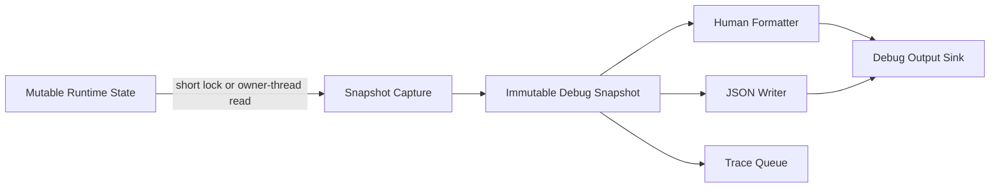

# Thread-Safe Debugging Utilities

## Purpose

This document defines the modern debugging utility model for the rewrite.

Filesystem diagnostics are the first consumer, but the utilities should be
usable by renderer, platform, resource loading, commands/cvars, UI, networking,
and future tooling. The goal is to avoid each subsystem inventing its own
logging, snapshot, serialization, and threading behavior.

For the detailed module layout and first implementation slice, see
[debugging/architecture.md](debugging/architecture.md). For the proposed
namespace and class inventory, see
[debugging/api-inventory.md](debugging/api-inventory.md).

## Design Goals

- Keep debug capture safe around mutable runtime state.
- Keep formatting and JSON serialization outside critical sections.
- Support human-readable output and stable machine-readable output from the
  same data.
- Allow synchronous use first, with an async path later.
- Avoid exposing STL, exceptions, or third-party library types across public C
  ABI boundaries.
- Keep release builds cheap when debug and trace output are disabled.

## Non-Goals

- This is not a public SDK API.
- This does not require broad engine multithreading now.
- This does not replace existing console commands in one pass.
- This does not require exceptions, RTTI, or a new JSON dependency before the
  first implementation needs one.

## Architecture



The key rule is:

```text
capture quickly -> release runtime ownership -> format or serialize later
```

Runtime objects should not format themselves. They should provide a way to
capture small, immutable debug records.

## Core Concepts

### Debug Snapshot

A debug snapshot is an immutable copy of relevant state at one moment.

Example shape:

```cpp
struct DebugSnapshotHeader
{
    const char *schema;
    uint64_t sequence;
    uint64_t timestamp_usec;
};

struct SearchPathDebugRecord
{
    int order;
    const char *type;
    const char *source;
    uint32_t flags;
    bool writable;
};
```

Snapshot records should be plain data where possible. If strings need owned
storage, the snapshot owns that storage. Runtime objects remain free to mutate
after capture.

### Debug Formatter

Formatters turn snapshots into human-readable output. They should not call back
into runtime systems except for the final output sink.

Human output should be stable enough for developers to recognize, but it is not
the compatibility contract. JSON schemas are the machine-readable contract.

### JSON Writer

JSON output should be generated from the same snapshot records as human output.

Policy:

- include a schema name, such as `xash3d.fs.mounts.v1`
- use stable field names once tests consume them
- prefer explicit fields over encoded strings
- omit BSON until a real binary transport requirement exists

Current implementation:

- use `xash::debugging::json::JsonWriter` for shared object/array emission
- keep RapidJSON deferred until debug snapshots need parsing, DOM mutation, or
  enough nested serialization complexity to justify a vendored dependency

### Debug Sink

A debug sink is the final output target. It might write to the engine console,
test buffers, files, or future tooling.

Suggested private interface:

```cpp
enum class DebugOutputFormat
{
    Human,
    Json,
};

class DebugSink
{
public:
    virtual ~DebugSink() = default;
    virtual void write(DebugOutputFormat format, const char *text) = 0;
};
```

The sink boundary is where platform-specific output belongs. Snapshot capture
and formatting should stay platform-neutral.

### Trace Event

Trace events are high-volume debug records. They are different from command
snapshots because they may be emitted from hot paths.

Suggested shape:

```cpp
enum class TraceLevel
{
    Debug,
    Verbose,
    Trace,
};

struct TraceEvent
{
    uint64_t sequence;
    uint64_t timestamp_usec;
    TraceLevel level;
    const char *category;
    const char *message;
};
```

Trace event creation must be cheap when disabled. Expensive formatting should
not happen unless the category and level are enabled.

## Threading Contract

### Capture Rules

- Capture may briefly lock subsystem state or run on the subsystem owner
  thread.
- Capture must not perform slow formatting, allocation-heavy JSON writing, disk
  IO, or console output while holding runtime locks.
- Snapshot records must be immutable after publication.
- Snapshot readers should not need locks.

### Mutation Rules

- Subsystems must define which operations mutate state.
- Debug utilities should not hide mutations behind innocent-looking read APIs.
- Registry changes, mount changes, backend swaps, and logger sink replacement
  are write-side operations.

### Async Rules

Async debug paths should use bounded queues or fixed-size ring buffers.

Required behavior:

- define capacity
- define overflow policy
- track dropped events
- flush or discard explicitly on shutdown
- avoid indefinite main-thread blocking

Acceptable overflow policy for trace mode:

```text
drop newest event and increment dropped counter
```

or:

```text
drop oldest event and record the number skipped
```

The chosen policy should be visible in diagnostic output.

## Locking Model

Start simple:

- use owner-thread capture or a normal mutex for first implementations
- keep lock windows small
- copy the data needed for output
- release lock before formatting

Optimize only after tests and profiling show contention.

Possible later filesystem shape:

```cpp
class FilesystemDebugAccess
{
public:
    FilesystemMountSnapshot captureMountSnapshot() const;
    FilesystemLookupSnapshot explainLookup(const char *path) const;
};
```

Implementation options can evolve from mutex-protected state to immutable
search-path snapshots without changing debug command behavior.

## Logging Relationship

Debug utilities and logging should share concepts but remain separate:

- logging is an event stream
- debug commands capture current state
- trace mode is a high-volume event stream with explicit gating

The logging facade may later use `spdlog`, but subsystem code should depend on
engine-owned logging interfaces, not `spdlog` directly.

The initial logging facade now includes `LogLevel`, `LogCategory`, `LogRecord`,
`ILogSink`, `LogGate`, and `Logger`. It accepts preformatted messages only;
formatting policy remains deferred until the project decides whether to use
`{fmt}` or another backend.

Current thread-safety guarantees are tracked in
[debugging/thread-safety-audit.md](debugging/thread-safety-audit.md).

## Serialization Relationship

Serialization helpers should be reusable by debug commands and tests.

Preferred flow:

```text
runtime state -> snapshot -> test assertions
                         \-> human formatter
                         \-> JSON writer
```

Tests should prefer snapshot records when linked in-process. JSON should be
used when testing command output, external tooling, or process boundaries.

## Filesystem First Consumers

The filesystem pilot should use these utilities for:

- `fs_path_verbose`: capture and format mounted search paths
- `fs_why <path>`: capture lookup attempts and winning path
- `fs_find_all <path>`: capture all matches across search paths
- `fs_registry`: capture registered backend/archive metadata
- optional trace mode around lookup and archive mounting

These commands should not directly walk mutable linked lists while printing.
They should capture records first, then print.

## Suggested Implementation Order

1. Add private snapshot record structs for filesystem mounts and lookups.
2. Add a synchronous `DebugSink` backed by the engine console or a test buffer.
3. Add human formatters for filesystem mount snapshots.
4. Add JSON writer helpers for the same snapshots.
5. Add unit tests that inspect snapshots directly.
6. Add command output tests for human and JSON formatting.
7. Add trace category and level gates.
8. Add a bounded queue or ring buffer only when trace volume requires it.

## Acceptance Checklist

A debug utility implementation is acceptable when:

- it does not expose third-party types across public ABI boundaries
- it does not hold runtime locks while formatting or writing output
- it has stable snapshot records
- it has at least one test path that does not depend on visual inspection
- disabled trace output avoids expensive formatting work
- async paths have bounded memory behavior and visible dropped-event counters
- shutdown behavior is explicit
