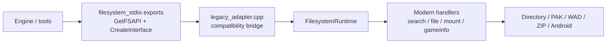

# Modern Filesystem Handlers TODO

## Purpose

Track the next migration stage after the export/dependency audit: move more
legacy-facing filesystem behavior into modern handlers while preserving the
current `filesystem_stdio` DLL/SO exports and public ABI.

The intended direction is that `src/filesystem/` becomes the implementation
home, and legacy compatibility is concentrated into a small adapter layer. A
future `src/filesystem/legacy_adapter.cpp` can own the compatibility bridge for
legacy `fs_api_t`, `VFileSystem009`, `searchpath_t`, `file_t`, and
`fs_globals_t` interactions. The current `filesystem/` folder should shrink
toward loader/export glue plus temporary C wrappers until it can be retired.

## Target Shape

## Phase 28 Tasks

- [x] `FS-HANDLER-001` Define the first `LegacyAdapter` boundary.
  Evidence: `filesystem/filesystem_facade_adapter.h`,
  `Documentation/codex/todo/modern_filesystem_handlers_todo.md`.
  Notes: it should expose C-compatible functions to legacy facades but keep
  modern C++ types private to `src/filesystem`.

- [x] `FS-HANDLER-002` Move `VFileSystem009.cpp` off
  `filesystem_internal.h`.
  Evidence: `filesystem/filesystem_facade_adapter.h`,
  `filesystem/filesystem_facade_adapter.cpp`, `filesystem/VFileSystem009.cpp`;
  `.\waf.bat build --targets=test_interface`, direct
  `build\filesystem\test_interface.exe`, and `.\waf.bat build` passed on
  2026-05-09.
  Notes: add a narrow facade adapter for `FS_ClearSearchPath`,
  `FS_AddGameDirectory`, `FS_Open`, `FS_Search`, `Mem_Free`, `Con_DPrintf`,
  and other exact calls used by the Valve wrapper.

- [x] `FS-HANDLER-003` Extract `FS_Search` result assembly into a modern
  handler.
  Evidence: `filesystem/search_result_builder_adapter.cpp`,
  `filesystem/search_result_builder_adapter.h`, `filesystem/filesystem.c`;
  `.\waf.bat build --targets=test_search-results,test_filesystem_search_result_builder`,
  direct `build\filesystem\test_search-results.exe`, and direct
  `build\src\test_filesystem_search_result_builder.exe`,
  `.\waf.bat build --targets=test_interface`, and direct
  `build\filesystem\test_interface.exe` passed on
  2026-05-09.
  Notes: keep public `search_t` allocation/layout compatible, but move
  sorting, duplicate compaction, and packed result copying behind
  `SearchResultBuilder`.

- [x] `FS-HANDLER-004` Move file handle operation bodies behind modern
  handlers.
  Evidence: `src/include/filesystem/file_handle_ops.hpp`,
  `src/filesystem/file_handle_ops.cpp`,
  `filesystem/file_handle_ops_adapter.h`,
  `filesystem/file_handle_ops_adapter.cpp`, `filesystem/filesystem.c`,
  `tests/filesystem/file_handle_ops.cpp`; command
  `.\waf.bat build --targets=test_filesystem_runtime,test_filesystem_file_handle_ops,test_file-handle,test_archive-order,test_wad-archive,test_zip-archive`
  passed 6/6 tests on 2026-05-09; `.\waf.bat build` passed 25/25
  tests.
  Notes: `file_t` is opaque publicly, so this can proceed more aggressively
  than `search_t` or `gameinfo_t`. Preserve `XASH_REDUCE_FD`, buffered IO,
  deflated ZIP reads, and CRLF line behavior.

- [x] `FS-HANDLER-005` Move searchpath allocation and callback registration
  into runtime-owned mount handlers.
  Evidence: `src/include/filesystem/filesystem_runtime.hpp`,
  `src/filesystem/filesystem_runtime.cpp`,
  `filesystem/filesystem_runtime_adapter.h`,
  `filesystem/filesystem_runtime_adapter.cpp`,
  `filesystem/searchpath_mount_adapter.h`,
  `filesystem/searchpath_mount_adapter.cpp`, `filesystem/dir.c`,
  `filesystem/pak.c`, `filesystem/wad.c`, `filesystem/zip.c`,
  `filesystem/android.c`, `tests/filesystem/filesystem_runtime.cpp`;
  command
  `.\waf.bat build --targets=test_filesystem_runtime,test_filesystem_file_handle_ops,test_file-handle,test_archive-order,test_wad-archive,test_zip-archive`
  passed 6/6 tests on 2026-05-09; `.\waf.bat build` passed 25/25
  tests.
  Notes: backend `.c` files should stop allocating `searchpath_t` directly
  once runtime-owned compatibility views exist.

- [x] `FS-HANDLER-006` Split `filesystem_internal.h` into focused private
  compatibility headers.
  Evidence: `filesystem/filesystem_internal.h`,
  `src/include/filesystem/compat/private/filesystem_private_types.h`,
  `src/include/filesystem/compat/private/filesystem_private_globals.h`,
  `src/include/filesystem/compat/private/filesystem_private_memory.h`,
  `src/include/filesystem/compat/private/filesystem_private_api.h`; commands
  `.\waf.bat build --targets=test_filesystem_runtime,test_filesystem_file_handle_ops,test_file-handle,test_archive-order,test_wad-archive,test_zip-archive,test_interface`,
  `.\waf.bat build`, direct `build\filesystem\test_interface.exe`,
  direct `build\filesystem\test_file-handle.exe`, direct
  `build\filesystem\test_archive-order.exe`, and direct
  `build\src\test_filesystem_runtime.exe` passed on 2026-05-09.
  Notes: keep legacy layouts together, but move adapter declarations and
  subsystem-specific hooks out of the monolithic header.

- [x] `FS-HANDLER-007` Create gameinfo snapshot/query plan before moving
  `FI.games`.
  Evidence: `Documentation/codex/modern/filesystem/gameinfo-snapshot-plan.md`.
  Notes: engine UI/game switching still reads `FI` directly, so runtime should
  mirror public state until callers move to queries.

## Implementation Rules

- Do not remove `GetFSAPI` or `CreateInterface`.
- Do not change `filesystem.h` or `VFileSystem009.h` layout/signatures in this
  phase.
- Do not expose modern C++ implementation classes through public headers.
- Every moved handler needs either a focused modern unit test or an existing
  filesystem DLL-facing test that covers the moved behavior.
- Keep `filesystem/` source files compiling as compatibility shims until the
  build no longer references them.

## First Suggested Slice

Start with `FS-HANDLER-002` because it is narrow and high-signal:

1. Add a small C-compatible `filesystem_facade_adapter.h/.cpp`.
2. Route the exact `VFileSystem009.cpp` operations through that adapter.
3. Remove `filesystem_internal.h` from `VFileSystem009.cpp`.
4. Run `test_interface` plus the full filesystem behavior test set.

That gives us an immediate reduction in private-header coupling without
changing the DLL/SO exports or public vtable.

## Current Compatibility Boundary

The first slice added `filesystem/filesystem_facade_adapter.h/.cpp` as a
temporary C-compatible bridge. `VFileSystem009.cpp` now includes that narrow
adapter instead of `filesystem_internal.h`.

This is intentionally still under `filesystem/` because it calls legacy
functions and macros directly. When enough handlers live under `src/filesystem`,
this boundary can move inward and become the proposed
`src/filesystem/legacy_adapter.cpp`.
